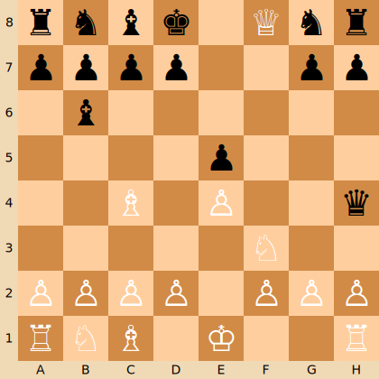

<p align="center">
  
</p>

---

<p align="center">


<br>


</p>

<div align="center">
<h1>♟️ Sistema backend per il gioco degli scacchi</h1>
Questo progetto implementa un robusto sistema backend per il gioco degli scacchi in <b>TypeScript</b> utilizzando <b>Node.js</b>, <b>Express.js</b>, <b>Sequelize</b> e altri strumenti moderni. Sviluppato come parte del corso di Laurea Magistrale in Ingegneria Informatica e dell'Automazione (<b>LM-32</b>) presso l'<b>UNIVPM</b> per l'anno accademico 2023-2024, dimostra l'applicazione di pratiche professionali di sviluppo backend e design pattern.<br>
Il sistema è stato sviluppato dagli studenti <a href="https://github.com/nicolobartolinii">Nicolò Bartolini</a> e <a href="https://github.com/NicolaPicciafuoco">Nicola Picciafuoco</a> per il corso di <b>Programmazione Avanzata</b> tenuto dal Prof. Adriano Mancini.<br>
Gli obiettivi dettagliati del progetto, le caratteristiche uniche e gli aspetti tecnici approfonditi sono discussi nelle sezioni seguenti di questo README.
</div>

---

# 🇬🇧 [Versione inglese (english version)](README.md)

# 📋 Indice

- [🎯 Obiettivi del progetto](#-obiettivi-del-progetto)
- [🛠️ Strumenti utilizzati](#-strumenti-utilizzati)
- [🧩 Pattern utilizzati](#-pattern-utilizzati)
    - [🏗️ Model-Controller (MVC)](#-mvc-model-controller)
    - [🗄️ Data Access Object (DAO)](#-data-access-object-dao)
    - [📦 Repository](#-repository)
    - [🔒 Singleton](#-singleton)
    - [⛓️ Chain of Responsibility](#-chain-of-responsibility)
    - [🏭 Factory Method](#-factory-method)
    - [🔀 Strategy](#-strategy)
- [📚 Documentazione API](#-documentazione-api)
  - [POST `/login`](#post-login)
  - [POST `/admin/update-tokens`](#post-adminupdate-tokens)
  - [GET `/players/ranking`](#get-playersranking)
  - [POST `/games`](#post-games)
  - [GET `/games`](#get-games)
  - [GET `/games/{gameId}/status`](#get-gamesgameidstatus)
  - [GET `/games/{gameId}/win-certificate`](#get-gamesgameidwin-certificate)
  - [POST `/games/{gameId}/move`](#post-gamesgameidmove)
  - [GET `/games/{gameId}/chessboard`](#get-gamesgameidchessboard)
  - [GET `/games/{gameId}/details`](#get-gamesgameiddetails)
  - [POST `/games/{gameId}/abandon`](#post-gamesgameidabandon)
- [📊 Diagrammi UML](#-diagrammi-uml)
  - [Diagramma dei casi d'uso](#diagramma-dei-casi-duso)
  - [Diagrammi di sequenza](#diagrammi-di-sequenza)
- [🚀 Installazione e utilizzo](#-installazione-e-utilizzo)
- [🧪 Testing](#-testing)
- [🌟 Funzionalità aggiuntive](#-funzionalità-aggiuntive)
- [👥 Autori](#-autori)
- [📄 Licenza](#-licenza)
- 
# 🎯 Obiettivi del progetto

Questo progetto mira a sviluppare un sistema backend robusto e sicuro per un'applicazione di gioco degli scacchi, dimostrando concetti di programmazione avanzata e le migliori pratiche nello sviluppo backend. Gli obiettivi principali sono:

1. Implementare un **sistema backend per il gioco degli scacchi** che permetta agli utenti di giocare contro l'IA o altri giocatori, integrando la libreria [`js-chess-engine`](https://npmjs.com/package/js-chess-engine) per la logica di gioco.
2. Sviluppare un sicuro sistema di **autenticazione asimmetrica basata su JWT** con controllo degli accessi basato sui ruoli, inclusa la funzionalità di amministrazione.
3. Creare un'**economia basata su token** per la partecipazione alle partite, con costi specifici per la creazione delle partite e l'effettuazione delle mosse.
4. Progettare e implementare **endpoint API RESTful** per la gestione delle partite, l'esecuzione delle mosse, il monitoraggio dello stato del gioco e altre funzionalità.
5. Implementare la **funzionalità di esportazione dei dati** in formati JSON e PDF, inclusi i certificati di vittoria.
6. Creare un **sistema di classifica pubblica non autenticata** con opzioni di ordinamento personalizzabili.
7. Integrare un database utilizzando [**Sequelize ORM**](https://sequelize.org/) per memorizzare efficientemente i dati di gioco e degli utenti.
8. Implementare **middleware** per la _validazione delle richieste_, la _gestione degli errori_ e altre problematiche trasversali.
9. Garantire la qualità del codice attraverso l'uso di **TypeScript**, _commenti esaustivi_ e l'applicazione di vari _design pattern_.
10. Configurare il progetto per un **facile avvio** utilizzando [Docker](https://www.docker.com/) e [Docker Compose](https://docs.docker.com/compose/).
11. Sviluppare una **suite di test completa** utilizzando [Postman](https://www.postman.com/) e [Newman](https://www.npmjs.com/package/newman) per garantire l'affidabilità dell'API.
12. Aderire ai principi di progettazione delle API RESTful e alle migliori pratiche di sviluppo backend durante tutto il progetto.

Questo sistema backend per il gioco degli scacchi serve come applicazione pratica di tecniche di programmazione avanzate, dimostrando la capacità di creare un'applicazione scalabile, manutenibile e ricca di funzionalità in un contesto reale.

# 🛠️ Strumenti utilizzati

Questo progetto sfrutta una varietà di strumenti e tecnologie moderne per lo sviluppo backend:

- [Node.js](https://nodejs.org/)
- [Express.js](https://expressjs.com/)
- [TypeScript](https://www.typescriptlang.org/)
- [Sequelize](https://sequelize.org/)
- [PostgreSQL](https://www.postgresql.org/)
- [Docker](https://www.docker.com/) e [Docker Compose](https://docs.docker.com/compose/)
- [js-chess-engine](https://www.npmjs.com/package/js-chess-engine) - Motore di scacchi JavaScript per la logica di gioco
- [JWT (JSON Web Tokens)](https://jwt.io/)
- [Postman](https://www.postman.com/) e [Newman](https://www.npmjs.com/package/newman)
- [PDFKit](https://pdfkit.org/) - Libreria per la generazione di PDF per Node.js
- [Mermaid](https://mermaid-js.github.io/mermaid/#/) - Strumento per la creazione di diagrammi e grafici
- [bcryptjs](https://www.npmjs.com/package/bcryptjs) e [sequelize-bcrypt](https://www.npmjs.com/package/sequelize-bcrypt) - Librerie per l'hashing delle password
- [Sharp](https://sharp.pixelplumbing.com/) - Elaborazione di immagini ad alte prestazioni per Node.js

# 🧩 Pattern utilizzati

Questo progetto implementa diversi pattern per garantire un codice robusto, manutenibile e scalabile. Ogni pattern affronta sfide specifiche nella progettazione del software e contribuisce alla qualità complessiva dell'applicazione.

## 🏗️ MVC (Model-Controller)

Il pattern architetturale **Model-Controller** (**MC**) è utilizzato per separare le responsabilità nell'applicazione:

- **Model**: rappresentano le strutture dati e lo schema del database, incapsulando la logica di business e la manipolazione dei dati.
- **Controller**: gestiscono le richieste HTTP in arrivo, elaborano i dati utilizzando i model e restituiscono risposte appropriate.

Poiché questo è un progetto esclusivamente backend, il tradizionale livello **View** è omesso, risultando in una struttura MC piuttosto che MVC.

## 🗄️ Data Access Object (DAO)

Il pattern **DAO** fornisce un'interfaccia astratta per il database, incapsulando tutta la logica di accesso ed esponendo metodi per le operazioni sul database.

#### Implementazione

Sfruttato attraverso Sequelize ORM per [definire i modelli del database](https://github.com/nicolobartolinii/chess-backend/blob/main/src/models) e interagire con il database. Questa astrazione semplifica l'integrazione del database e permette un più facile passaggio tra diversi sistemi di database, se necessario.

## 📦 Repository

Il pattern **Repository** fa da mediatore tra i livelli di dominio e di mappatura dei dati, agendo come una collection in-memory di oggetti del dominio dell'applicazione. Questo pattern centralizza la logica di accesso ai dati, migliorando la manutenibilità e permettendo una più facile implementazione di strategie di caching o di recupero dati.

#### Implementazione

Definisce [metodi per le query e le interazioni con il database](https://github.com/nicolobartolinii/chess-backend/blob/main/src/repositories), lavorando con i modelli Sequelize (DAO) per fornire una funzionalità pulita per l'accesso ai dati.

## 🔒 Singleton

Il pattern creazionale [Singleton](https://refactoring.guru/design-patterns/singleton) assicura che una classe abbia una sola istanza e fornisce un punto di accesso globale ad essa.

<p align="center">
    
</p>

*Fonte dell'immagine: [Refactoring Guru](https://refactoring.guru/design-patterns/singleton),
con [permesso](https://refactoring.guru/content-usage-policy)

#### Implementazione

Utilizzato per la [gestione delle connessioni al database](https://github.com/nicolobartolinii/chess-backend/blob/main/src/db/sequelizeConnection.ts), assicurando che solo una connessione sia mantenuta durante tutto il ciclo di vita dell'applicazione. Questo ottimizza l'uso delle risorse e fornisce un'interfaccia coerente per le operazioni sul database.

## ⛓️ Chain of Responsibility

Il pattern comportamentale [Chain of Responsibility](https://refactoring.guru/design-patterns/chain-of-responsibility) passa le richieste lungo una catena di gestori (handler), permettendo a più oggetti di gestire la richiesta senza accoppiare il mittente al ricevitore.

<p align="center">
    
</p>

*Fonte dell'immagine: [Refactoring Guru](https://refactoring.guru/design-patterns/chain-of-responsibility),
con [permesso](https://refactoring.guru/content-usage-policy)

#### Implementazione

Utilizzato attraverso il [sistema di middleware di Express.js](https://expressjs.com/en/guide/using-middleware.html), dove ogni funzione middleware può elaborare la richiesta, eseguire compiti specifici (i.e.: autenticazione, validazione, gestione degli errori) e decidere se passarla al gestore successivo nella catena. Questo crea una pipeline di elaborazione delle richieste flessibile ed estensibile.

Nel nostro progetto, il pattern Chain of Responsibility è applicato per gestire [la validazione delle richieste, l'autenticazione e la gestione degli errori](https://github.com/nicolobartolinii/chess-backend/blob/main/src/middlewares) in modo modulare e componibile.

## 🏭 Factory Method

Il pattern creazionale [Factory Method](https://refactoring.guru/design-patterns/factory-method) fornisce un'interfaccia per creare oggetti in una superclasse, permettendo alle sottoclassi di alterare il tipo di oggetti creati.

<p align="center">
    
</p>

*Fonte dell'immagine: [Refactoring Guru](https://refactoring.guru/design-patterns/factory-method),
con [permesso](https://refactoring.guru/content-usage-policy)

#### Implementazione

- [`ResponseFactory`](https://github.com/nicolobartolinii/chess-backend/blob/main/src/factories/responseFactory.ts): crea risposte JSON standardizzate, assicurando coerenza in tutta l'API.
- [`ErrorFactory`](https://github.com/nicolobartolinii/chess-backend/blob/main/src/factories/errorFactory.ts): genera strutture di errore coerenti, facilitando una gestione e un reporting degli errori uniformi.

Questo approccio centralizza la logica di creazione degli oggetti e rende più facile modificare o estendere la gestione delle risposte e degli errori in futuro.

## 🔀 Strategy

Il pattern comportamentale [Strategy](https://refactoring.guru/design-patterns/strategy) definisce una famiglia di algoritmi, incapsula ciascuno di essi e li rende intercambiabili.

<p align="center">
    
</p>

*Fonte dell'immagine: [Refactoring Guru](https://refactoring.guru/design-patterns/strategy),
con [permesso](https://refactoring.guru/content-usage-policy)

#### Implementazione

Utilizzato per [esportare la cronologia delle mosse di gioco in diversi formati](https://github.com/nicolobartolinii/chess-backend/blob/main/src/strategies):

- `JSONExportStrategy`: gestisce l'esportazione in formato JSON.
- `PDFExportStrategy`: gestisce l'esportazione in formato PDF.

Questo pattern permette una facile estensione per supportare formati di esportazione aggiuntivi in futuro senza modificare il codice esistente.

# 📚 Documentazione API

| Verbo HTTP | Endpoint                          | Descrizione                                                      | Autenticazione JWT |
|------------|-----------------------------------|------------------------------------------------------------------|:------------------:|
| POST       | `/login`                          | Autenticazione dell'utente                                       |         ❌          |
| POST       | `/admin/update-tokens`            | Ricarica dei token dell'utente (solo admin)                      |         ✅          |
| GET        | `/players/ranking `               | Recupero della classifica dei giocatori per punteggio            |         ❌          |
| POST       | `/games`                          | Creazione di una nuova partita di scacchi                        |         ✅          |
| GET        | `/games`                          | Recupero della cronologia delle partite completate dall'utente   |         ✅          |
| GET        | `/games/{gameId}/status`          | Recupero dello stato attuale di una specifica partita di scacchi |         ✅          |
| GET        | `/games/{gameId}/win-certificate` | Generazione del certificato di vittoria per una partita          |         ✅          |
| POST       | `/games/{gameId}/move`            | Esecuzione di una mossa nella partita                            |         ✅          |
| GET        | `/games/{gameId}/chessboard`      | Recupero della configurazione più recente della scacchiera       |         ✅          |
| GET        | `/games/{gameId}/details`         | Recupero dei dettagli della partita (formato PDF o JSON)         |         ✅          |
| POST       | `/games/{gameId}/abandon`         | Abbandono di una partita                                         |         ✅          |

## POST `/login`

L'endpoint POST `/login` è utilizzato per autenticare un utente. L'utente deve fornire un'email e una password nel corpo della richiesta. L'email viene utilizzata per trovare il giocatore nel database e la password viene utilizzata per autenticare il giocatore. Se il giocatore viene autenticato con successo, viene generato un token JWT e restituito al giocatore per autenticare le richieste future.

### Parametri

| Posizione      | Nome       | Tipo     | Descrizione                | Obbligatorio |
|----------------|------------|----------|----------------------------|:------------:|
| Body richiesta | `email`    | `string` | Indirizzo email dell'utente |      ✅       |
| Body richiesta | `password` | `string` | Password dell'utente        |      ✅       |

### Esempio di richiesta

```http
POST /login HTTP/1.1
Content-Type: application/json

{
  "email": "email@example.com",
  "password": "password"
}
```

### Esempio di risposta

```json
{
  "token": "eyJhbGciOiJIUzI1NiIsInR5cCI6IkpXVCJ9.eyJwYXlsb2FkIjoiZm9vIiwiaWF0IjoxNjI5MzUwNzQ4LCJleHAiOjE2MjkzNTA3NDh9.7"
}
```

## POST `/admin/update-tokens`

L'endpoint POST `/admin/update-tokens` consente a un utente admin di aggiornare i token di un giocatore. L'amministratore deve fornire l'email del giocatore e il numero di token da aggiungere o rimuovere nel body della richiesta. È richiesto un token JWT valido con ruolo di admin per autenticare la richiesta.

### Parametri

| Posizione      | Nome     | Tipo     | Descrizione                                   | Obbligatorio |
|----------------|----------|----------|-----------------------------------------------|:------------:|
| Body richiesta | `email`  | `string` | Email del giocatore di cui aggiornare i token |      ✅       |
| Body richiesta | `tokens` | `number` | Numero di token da aggiungere o rimuovere     |      ✅       |

### Esempio di richiesta

```http
POST /admin/update-tokens HTTP/1.1
Content-Type: application/json
Authorization: Bearer <JWT token>

{
  "email": "email@example.com",
  "tokens": 10
}
```

### Esempio di risposta

```json
{
  "success": true,
  "statusCode": 201,
  "message": "Player tokens updated successfully",
  "data": {
    "player_id": 2,
    "username": "franco",
    "email": "franco@giovanni.it",
    "tokens": "10.0000",
    "role": 0
  }
}
```

## GET `/players/ranking`

L'endpoint GET `/players/ranking` recupera la classifica dei giocatori basata sul numero di punti che hanno. Il client può specificare il campo in base al quale ordinare la classifica e l'ordine di ordinamento. Non è richiesto alcun token JWT per questo endpoint.

### Parametri

| Posizione      | Nome    | Tipo     | Descrizione                                         | Valori accettati | Obbligatorio |
|----------------|---------|----------|----------------------------------------------------|------------------|:------------:|
| Query richiesta | `field` | `string` | Il campo in base al quale ordinare la classifica.   | `points`         |      ✅       |
| Query richiesta | `order` | `string` | La direzione dell'ordinamento.                      | `asc`, `desc`    |      ✅       |

### Esemplio di richiesta

```http
GET /players/ranking?field=points&order=desc HTTP/1.1
```

### Esempio di risposta

```json
{
  "success": true,
  "statusCode": 200,
  "message": "Players retrieved successfully",
  "data": [
    {
      "player_id": 1,
      "username": "prova",
      "email": "prova@prova.it",
      "points": "0.0000",
      "tokens": "10.0000"
    },
    {
      "player_id": 2,
      "username": "franco",
      "email": "franco@giovanni.it",
      "points": "1.0000",
      "tokens": "8.1000"
    }
  ]
}
```

## POST `/games`

L'endpoint POST `/games` permette agli utenti di creare una nuova partita di scacchi. L'utente deve fornire nel body della richiesta o l'email dell'avversario o il livello di difficoltà dell'avversario IA. È richiesto un token JWT valido nell'header di Authorization per autenticare la richiesta.

### Parametri

| Posizione     | Nome            | Tipo     | Descrizione                              | Valori accettati                                               | Obbligatorio |
|---------------|-----------------|----------|------------------------------------------|-----------------------------------------------------------------|:------------:|
| Body richiesta | `email`         | `string` | Email dell'avversario umano              | Indirizzo email valido                                          |      *       |
| Body richiesta | `AI_difficulty` | `string` | Livello di difficoltà dell'avversario IA | `MONKEY`, `BEGINNER`, `INTERMEDIATE`, `ADVANCED`, `EXPERIENCED` |      *       |

\* Deve essere fornito o `email` o `AI_difficulty`, ma non entrambi.

### Esempio di richiesta

```http
POST /games HTTP/1.1
Content-Type: application/json
Authorization: Bearer <JWT token>

{
  "email": "opponent@example.com"
}
```

### Esempio di risposta

```json
{
  "success": true,
  "statusCode": 201,
  "message": "Game created successfully",
  "data": {
    "game_id": 3,
    "player_1_id": 1,
    "player_2_id": null,
    "AI_difficulty": "MONKEY",
    "game_status": "ACTIVE",
    "start_date": "2024-07-15T07:55:51.091Z"
  }
}
```

## GET `/games`

L'endpoint GET `/games` recupera la cronologia delle partite terminate dell'utente autenticato, ordinate per data di inizio in ordine crescente o decrescente. Il client può specificare la data di inizio da cui recuperare la cronologia delle partite e l'ordine di ordinamento. È richiesto un token JWT valido nell'header di Authorization per autenticare la richiesta.

### Parametri

| Posizione      | Nome         | Tipo     | Descrizione                                                 | Valori accettati            | Obbligatorio |
|----------------|--------------|----------|-------------------------------------------------------------|-----------------------------| :----------: |
| Query richiesta | `start_date` | `string` | La data da cui recuperare la cronologia delle partite.      | Data nel formato `YYYY-MM-DD` |      ❌       |
| Query richiesta | `order`      | `string` | La direzione dell'ordinamento.                              | `asc`, `desc`               |      ✅       |

### Esempio di richiesta

```http
GET /games?start_date=2024-07-10&order=desc HTTP/1.1
Authorization: Bearer <JWT token>
```

### Esempio di risposta

```json
{
  "success": true,
  "statusCode": 200,
  "message": "Games history retrieved successfully",
  "data": [
    {
      "game_id": 2,
      "game_status": "FINISHED",
      "number_of_moves": 11,
      "start_date": "2024-07-10T08:26:51.998Z",
      "winner_id": 2,
      "result": "You are the winner."
    }
  ]
}
```

## GET `/games/{gameId}/status`

L'endpoint GET `/games/{gameId}/status` recupera lo stato attuale di una specifica partita di scacchi. Il client deve fornire l'ID della partita nell'URL per identificare la partita, e un token JWT valido nell'header di Authorization per autenticare la richiesta.

### Parametri

| Posizione | Nome     | Tipo     | Descrizione                                                     | Obbligatorio |
|-----------|----------|----------|-----------------------------------------------------------------|:------------:|
| URL       | `gameId` | `number` | L'ID della partita per la quale si vuole recuperare lo stato.   |      ✅       |

### Esempio di richiesta

```http
GET /games/2/status HTTP/1.1
Authorization: Bearer <JWT token>
```

### Esempio di risposta

```json
{
  "success": true,
  "statusCode": 200,
  "message": "Game status retrieved successfully",
  "data": {
    "game_id": 2,
    "status": "FINISHED",
    "current_configuration": {
      "moves": {},
      "pieces": {
        "E1": "K",
        "...": "...",
        "F8": "Q"
      },
      "turn": "black",
      "isFinished": true,
      "check": true,
      "checkMate": true,
      "castling": {
        "whiteShort": true,
        "blackShort": false,
        "whiteLong": true,
        "blackLong": false
      },
      "enPassant": null,
      "halfMove": 4,
      "fullMove": 6
    },
    "opponent": 1,
    "winner_id": 2,
    "result": "You are the winner."
  }
}
```

## GET `/games/{gameId}/win-certificate`

L'endpoint GET `/games/{gameId}/win-certificate` recupera un certificato di vittoria per una specifica partita di scacchi in formato PDF. Il client deve fornire l'ID della partita nell'URL per identificare la partita, il giocatore deve essere il vincitore della partita e deve essere autenticato con un token JWT valido.

### Parametri

| Posizione | Nome     | Tipo     | Descrizione                                                     | Obbligatorio |
|-----------|----------|----------|-----------------------------------------------------------------|:------------:|
| URL       | `gameId` | `number` | L'ID della partita per la quale si vuole recuperare lo stato.   |      ✅       |

### Esempio di richiesta

```http
GET /games/2/win-certificate HTTP/1.1
Authorization: Bearer <JWT token>
```

### Esempio di risposta

[Qui](README-assets/win_certificate_example.pdf) è disponibile un esempio di certificato di vittoria in formato PDF. Di seguito, uno screenshot di quel certificato:


## POST `/games/{gameId}/move`

L'endpoint POST `/games/{gameId}/move` consente agli utenti di effettuare una mossa in una partita di scacchi attiva. L'utente deve fornire la mossa nel body della richiesta e l'ID della partita nell'URL per identificare la partita. L'utente deve anche fornire un token JWT nell'header di Authorization per autenticare la richiesta.

### Parametri

| Posizione     | Nome     | Tipo     | Descrizione                                      | Obbligatorio |
|---------------|----------|----------|--------------------------------------------------|:------------:|
| URL           | `gameId` | `number` | L'ID della partita in cui effettuare la mossa.   |      ✅       |
| Body richiesta | `from`   | `string` | La posizione di partenza della mossa.            |      ✅       |
| Body richiesta | `to`     | `string` | La posizione di arrivo della mossa.              |      ✅       |

### Esempio di richiesta

```http
POST /games/2/move HTTP/1.1
Content-Type: application/json
Authorization: Bearer <JWT token>

{
  "from": "C2",
  "to": "C4"
}
```

### Esempio di risposta

```json
{
  "success": true,
  "statusCode": 201,
  "message": "Move made successfully",
  "data": {
    "move": "You moved a White Pawn from C2 to C4. AI moved a Black Knight from F6 to E4."
  }
}
```

## GET `/games/{gameId}/chessboard`

L'endpoint GET `/games/{gameId}/chessboard` recupera la configurazione più recente della scacchiera di una specifica partita di scacchi. Il client deve fornire l'ID della partita nell'URL per identificare la partita, e il giocatore deve essere parte della partita. È richiesto un token JWT valido nell'header di Authorization per autenticare la richiesta.

### Parametri

| Posizione | Nome     | Tipo     | Descrizione                                                   | Obbligatorio |
|-----------|----------|----------|---------------------------------------------------------------|:------------:|
| URL       | `gameId` | `number` | L'ID della partita per la quale recuperare la configurazione. |      ✅       |

### Esempio di richiesta

```http
GET /games/2/chessboard HTTP/1.1
Authorization: Bearer <JWT token>
```

### Esempio di risposta



## GET `/games/{gameId}/details`

L'endpoint GET `/games/{gameId}/details` recupera i dettagli di una specifica partita di scacchi in formato JSON o PDF. Il giocatore deve essere parte della partita. Il client deve fornire l'ID della partita nell'URL per identificare la partita. È richiesto un token JWT valido nell'header di Authorization per autenticare la richiesta.

### Parametri

| Posizione      | Nome     | Tipo     | Descrizione                                                   | Valori accettati       | Obbligatorio |
|----------------|----------|----------|---------------------------------------------------------------|------------------------| :----------: |
| URL            | `gameId` | `number` | L'ID della partita per la quale recuperare i dettagli.        | ID numerici di partite |      ✅       |
| Query richiesta | `format` | `string` | Il formato in cui recuperare i dettagli.                      | `json`, `pdf`          |      ✅       |

### Esempio di richiesta

```http
GET /games/2/details?format=pdf HTTP/1.1
Authorization: Bearer <JWT token>
```

### Esempio di risposta (JSON)

```json
[
  {
    "player_name": "franco",
    "game_id": 2,
    "move_number": 1,
    "from_position": "E2",
    "to_position": "E4",
    "player_id": 2,
    "configuration_after": {
      "turn": "black",
      "check": false,
      "moves": {
        "A7": [
          "A6",
          "A5"
        ],
        "...": [
          "..."
        ]
      },
      "pieces": {
        "...": "..."
      },
      "castling": {
        "blackLong": true,
        "whiteLong": true,
        "blackShort": true,
        "whiteShort": true
      },
      "fullMove": 1,
      "halfMove": 0,
      "checkMate": false,
      "enPassant": "E3",
      "isFinished": false
    },
    "piece": "White Pawn",
    "moveEffect": "",
    "time_elapsed": "126h 56m 23s"
  },
  "...",
  {
    "player_name": "franco",
    "game_id": 2,
    "move_number": 11,
    "from_position": "F7",
    "to_position": "F8",
    "player_id": 2,
    "configuration_after": {
      "turn": "black",
      "check": true,
      "moves": {},
      "pieces": {
        "...": "..."
      },
      "castling": {
        "blackLong": false,
        "whiteLong": true,
        "blackShort": false,
        "whiteShort": true
      },
      "fullMove": 6,
      "halfMove": 4,
      "checkMate": true,
      "enPassant": null,
      "isFinished": true
    },
    "piece": "White Queen",
    "moveEffect": "CHECKMATE",
    "time_elapsed": "20s"
  }
]
```

### Esempio di risposta (PDF)

[Qui](README-assets/game_details_example.pdf) è disponibile un esempio di storico delle mosse di una partita in formato PDF. Di seguito, uno screenshot di quel PDF:


## POST `/games/{gameId}/abandon`

L'endpoint POST `/games/{gameId}/abandon` consente a un giocatore di abbandonare una partita. Il giocatore deve essere autenticato e deve essere uno dei giocatori della partita. La partita deve essere in corso. La partita viene contrassegnata come abbandonata (terminata) e il vincitore è l'altro giocatore. Il giocatore che abbandona la partita perde 0,5 punti e il vincitore guadagna 1 punto. È richiesto un token JWT valido nell'header di Authorization per autenticare la richiesta.

### Parametri

| Posizione | Nome     | Tipo     | Descrizione                           | Obbligatorio |
|-----------|----------|----------|---------------------------------------|:------------:|
| URL       | `gameId` | `number` | L'ID della partita da abbandonare.    |      ✅       |

### Esempio di richiesta

```http
POST /games/2/abandon HTTP/1.1
Authorization: Bearer <JWT token>
```

### Esempio di risposta

```json
{
  "success": true,
  "statusCode": 201,
  "message": "Game 1 abandoned. You lost!"
}
```

# 📊 Diagrammi UML

## Diagramma dei casi d'uso

Il seguente diagramma dei casi d'uso illustra le interazioni tra gli attori e il sistema in questa applicazione web.


\* Il caso d'uso contrassegnato con un asterisco (*) rappresenta tutti i casi d'uso che includono l'autenticazione tramite token JWT.
Ogni relazione `<<include>>` con il caso d'uso `Authenticate` indica che il token JWT è necessario per accedere alla
funzionalità specifica. Le molteplici relazioni `<<include>>` con il caso d'uso `Authenticate` sono state omesse per chiarezza.

## Diagrammi di sequenza

I diagrammi di sequenza seguenti illustrano le interazioni tra il client, l'applicazione e i vari componenti
coinvolti negli endpoint principali dell'applicazione.

### POST `/login`


### POST `/admin/update-tokens`


### GET `/players/ranking`


### GET `/games/history`


### POST `/games`


### GET `/games/{gameId}/win-certificate`


### GET `/games/{gameId}/details`


# 🚀 Installazione e utilizzo

In questa sezione viene fornita una guida passo-passo per configurare il progetto utilizzando Docker.

**Nota:** I passaggi descritti sono stati scritti per un sistema operativo basato su Unix. Alcuni comandi potrebbero differire per Windows.

### Prerequisiti

I seguenti strumenti devono essere installati per costruire ed eseguire il progetto:

- [Git](https://git-scm.com/downloads) - per la clonazione del repository.
- [Docker](https://www.docker.com/get-started) - per il building e l'esecuzione dei container.
- [Docker Compose](https://docs.docker.com/compose/install/) - per l'orchestrazione dei due servizi dell'applicazione.
- [SSH](https://www.ssh.com/ssh/command/) e [OpenSSL](https://www.openssl.org/) - per la generazione della coppia di chiavi JWT.

### Passo 1: Clonazione del repository

Il repository deve essere clonato nella posizione desiderata sulla macchina locale:

```bash
https://github.com/nicolobartolinii/chess-backend.git
cd chess-backend
```

### Passo 2: Configurazione dell'ambiente

Un file `.env` deve essere creato nella directory root del progetto. Il fac-simile del file [`.env.example`](https://github.com/nicolobartolinii/chess-backend/blob/main/.env.example) fornito può essere copiato
e le variabili dovrebbero essere regolate in base alle esigenze dell'ambiente:

```bash
cp .env.example .env
```

### Passo 3: Creazione della chiave privata e della chiave pubblica

Un file di chiave privata e uno di chiave pubblica devono essere creati nella directory root del progetto. Ciò si può effettuare con i seguenti comandi:

#### Per la chiave privata

```bash
ssh-keygen -t rsa -b 4096 -m PEM -f jwtRS256.key
```

#### Per la chiave pubblica

```bash
openssl rsa -in jwtRS256.key -pubout -outform PEM -out jwtRS256.key.pub
```

**Nota:** Il file di chiave pubblica fornito nel repository è un segnaposto e dovrebbe essere sostituito con quello generato.

### Passo 4: Building delle immagini Docker

Con Docker e Docker Compose installati, le immagini Docker per il progetto dovrebbero essere buildate.
In questo passo, il codice viene compilato, le dipendenze vengono installate e tutto il necessario per eseguire l'applicazione viene preparato.
Il seguente comando deve essere eseguito nella directory root del progetto:

```bash
docker-compose build
```

### Passo 5: Esecuzione dell'applicazione

```bash
docker-compose up -d 
```

La flag `-d` permette ai container di essere eseguiti in background, così il terminale può continuare ad essere utilizzato.

### Passo 6: Verifica dell'installazione

Per assicurarsi che tutto sia configurato correttamente, lo stato dei container può essere controllato con il comando:

```bash
docker-compose ps
```

### Passo 7: Accesso all'applicazione

Infine, si può accedere all'applicazione tramite un browser web o tramite Postman. L'applicazione dovrebbe essere disponibile all'indirizzo:

```bash
http://localhost:<PORTA_APPLICAZIONE>/
```

La porta predefinita per l'applicazione è 3000. Può essere cambiata nel file `.env`.

# 🧪 Testing

# 🌟 Funzionalità aggiuntive

Il progetto include miglioramenti oltre i requisiti forniti dal docente per migliorare l'esperienza utente e la funzionalità.

### Visualizzazione della scacchiera

- **Endpoint:** [GET /games/{gameId}/chessboard](#get-gamesgameidchessboard)
- **Funzione:** Restituisce un'immagine PNG dello stato più recente della scacchiera per una specifica partita
- **Integrazioni:**
    - Inclusa nei [certificati di vittoria](#get-gamesgameidwin-certificate)
    - Incorporata nelle esportazioni PDF della [cronologia delle mosse di gioco](#get-gamesgameiddetails)

Questa funzionalità aggiuntiva migliora la presentazione dei dati e facilita la comprensione della progressione del gioco. L'abbiamo implementata per rendere più semplici i test e il debugging.

# 👥 Autori

I contributori a questo progetto sono:

#### [Nicolò Bartolini](https://github.com/nicolobartolinii) (Matricola 1118768)
#### [Nicola Picciafuoco](https://github.com/NicolaPicciafuoco) (Matricola 1118755)

# 📄 Licenza

[Licenza MIT](LICENSE)

Copyright © 2024 Nicolò Bartolini, Nicola Picciafuoco