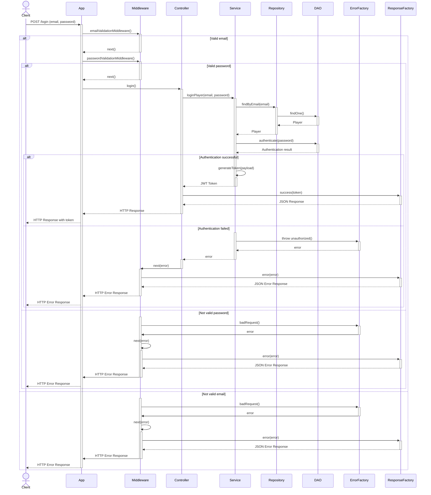
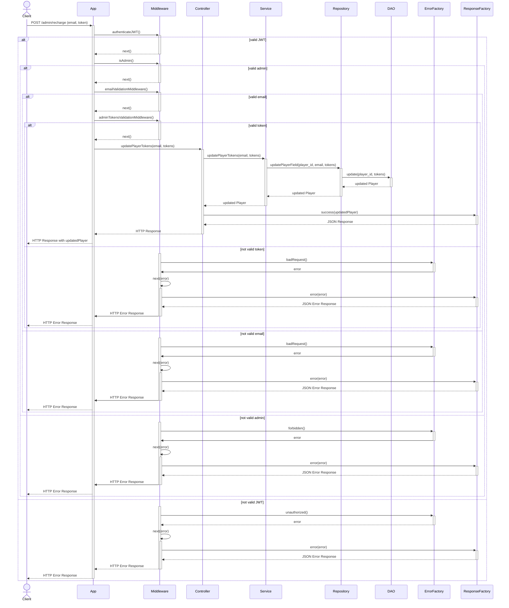
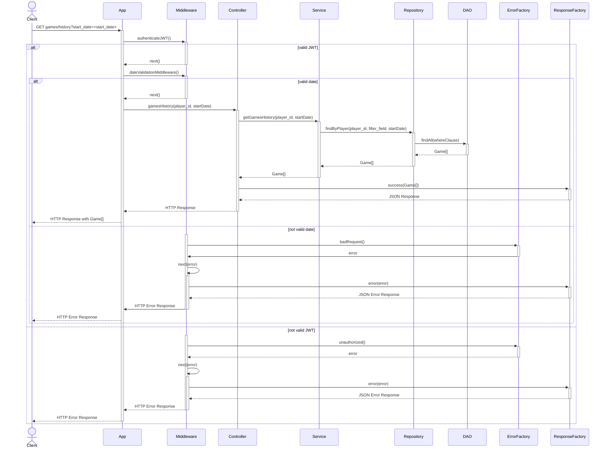

<p align="center">
  
</p>

---

<p align="center">


<br>


</p>

## POST `/login`

The login route is used to authenticate a user. The user must provide an email and a password in the request body. The email is used to find the player in the database and the password is used to authenticate the player. If the player is successfully authenticated, a JWT token is generated and returned to the player.

[//]: # (### Request body example)

[//]: # ()
[//]: # (```json)

[//]: # ({)

[//]: # (  "email": "email@example.com",)

[//]: # (  "password": "password")

[//]: # (})

[//]: # (```)

[//]: # ()
[//]: # (### Response example)

[//]: # ()
[//]: # (```json)

[//]: # ({)

[//]: # (  ")

[//]: # (    token": "eyJhbGciOiJIUzI1NiIsInR5cCI6IkpXVCJ9.eyJwYXlsb2FkIjoiZm9vIiwiaWF0IjoxNjI5MzUwNzQ4LCJleHAiOjE2MjkzNTA3NDh9.7")

[//]: # (})

[//]: # (```)

### Sequence diagram


# POST `/admin/update-token`

## GET `/players/ranking`

## GET /games/history




