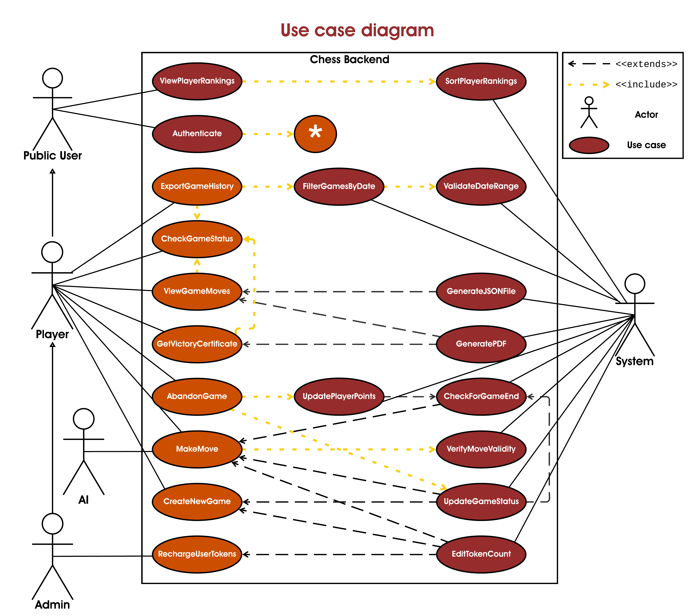
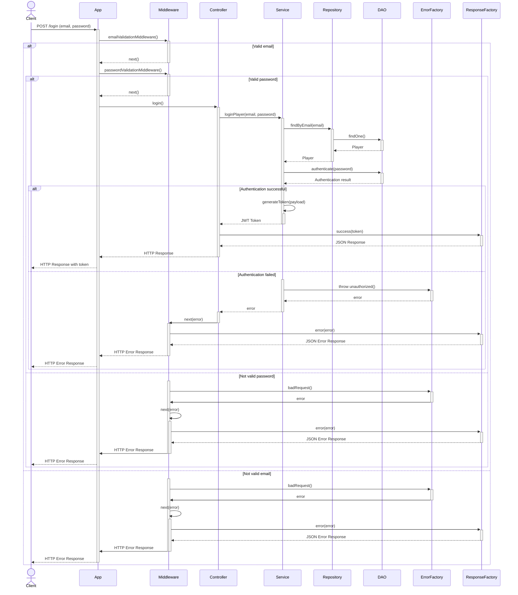
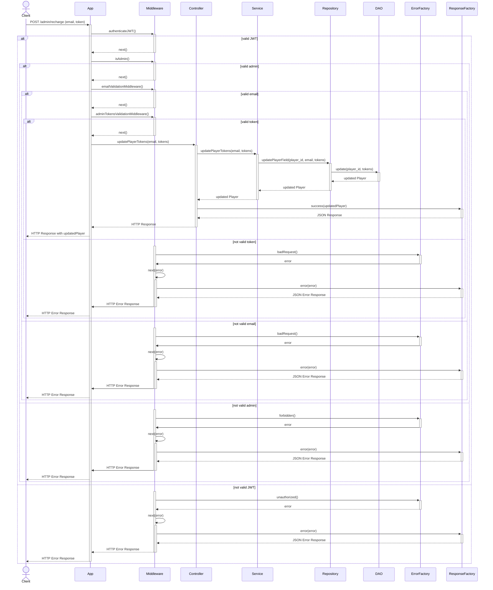
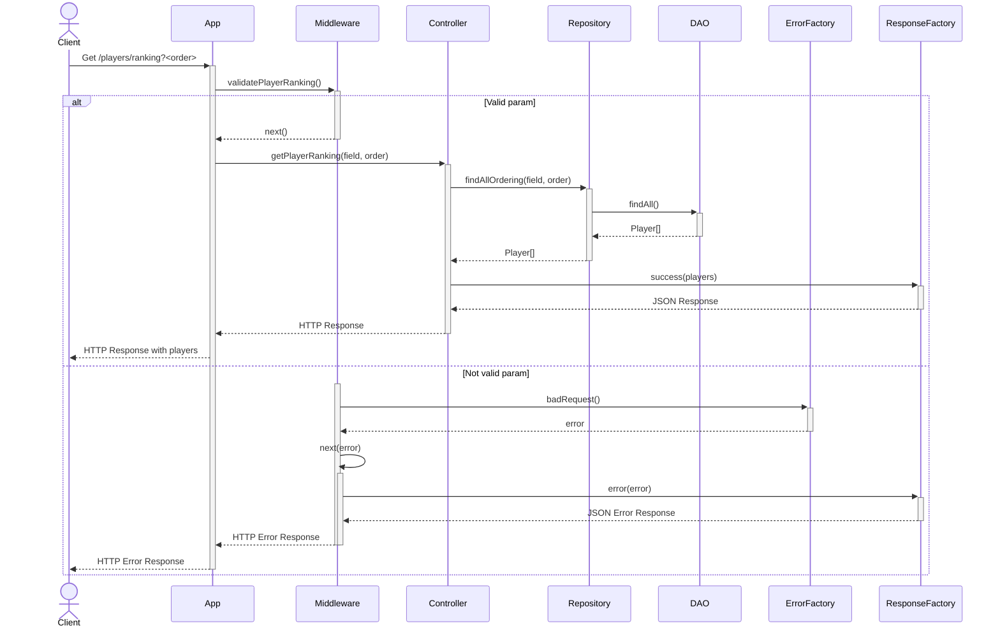
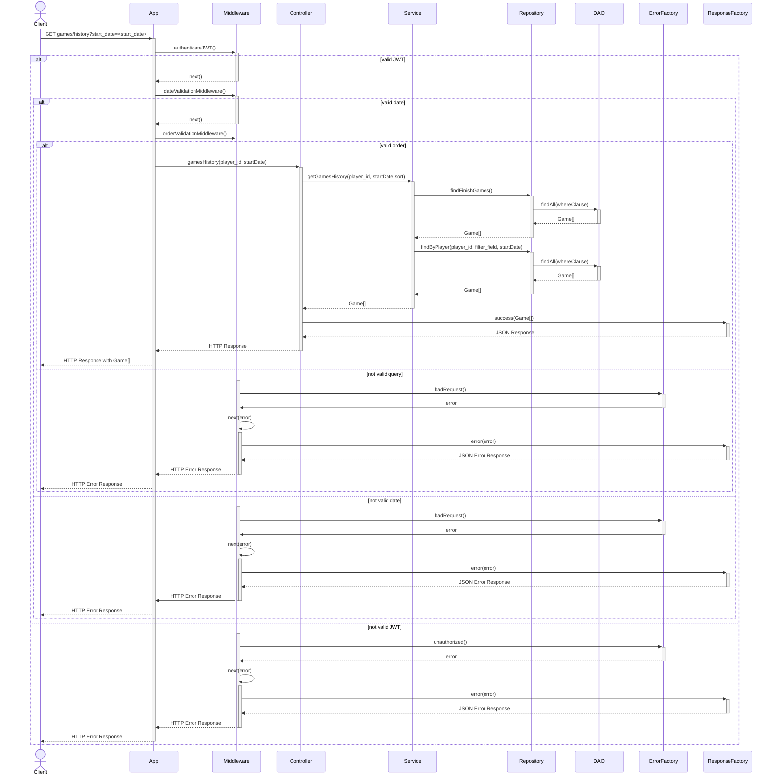
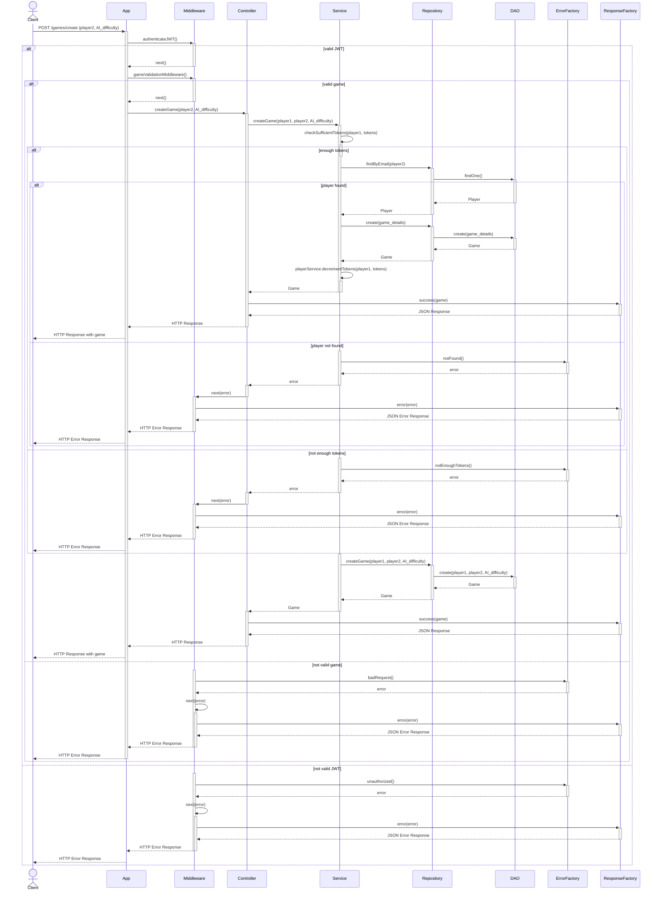
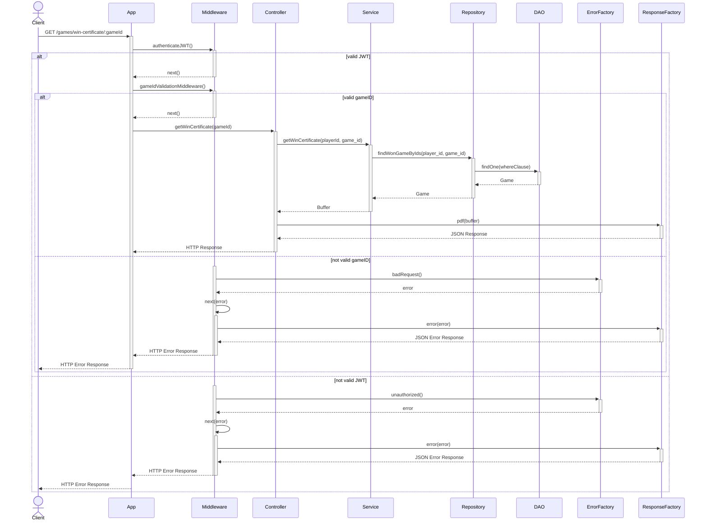
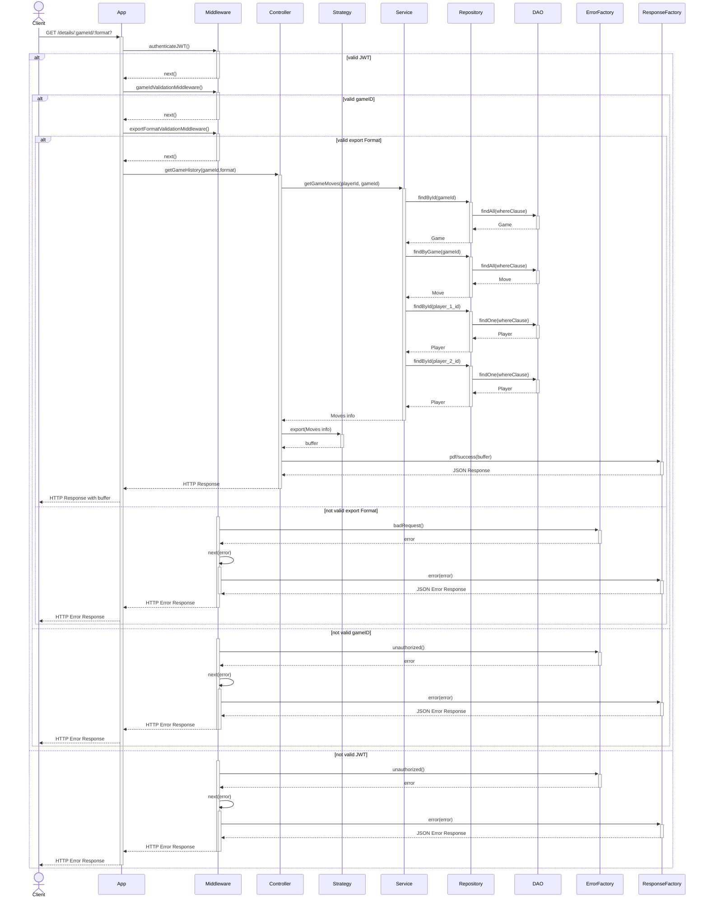

<p align="center">
  
</p>

---

<p align="center">


<br>


</p>

# Prograamazione -Avanzata UNIVPM 2023/24
####  The Advanced Programming project for the Computer and Automation Engineering course 2023/24 at the Polytechnic University of Marche

## Table of Contents
- [Project goals](#Project-goals)
- [Used tools](#usedTools)
- [Pattern used](#pattern)
  - [Singleton](#singleton)
  - [Sequalize](#sequelize)
    - [DAO](#dao)
  - [Repository](#repository)
  - [Strategy](#strategy)
  - [Factory](#factory)
  - [ModelViewController](#modelViewController)
  - [Middleware](#middleweare)
- [Routes](#Routes) 
  - [POST `/login`](#login)
- [UML diagrams](#umldiagrams)
  - [uses case](#usecase)
  - [sequenzadiagrams](#sequenzadiagrams)
- [Installation](#installation)
- [Contributing](#contributing)
- [License](#license)


# Use Case Diagram



# Project-goals

Here is a professional, cohesive translation of the project objectives for your advanced programming course into English:

The  goal of this project is to implement a robust backend system that enables authenticated users to create and play chess games, both against artificial intelligence and other users. The system incorporates several key features designed to enhance user experience and functionality:

## Key Features

- **Game Creation**: Users can start new chess matches utilizing the js-chess-engine, choosing either to face AI at varying levels of difficulty or to challenge other authenticated users. This flexibility supports a wide range of player skills and preferences.

- **Game Management**: The system adeptly handles multiple active games simultaneously. It ensures that a user participates in only one game at a time. Each activity within the platform, from creating games to making moves, incurs a deduction of tokens from the user's account based on a pre-defined tariff.

- **Game History**: Participants can access and review their completed games' history, which includes an comprehensive game details in PDF or Json format.

- **Player Ranking**: The system provides a feature to view the ranking by score of all players.

- **Admin Token Recharge**: Administrators have the ability to recharge tokens for other users.

- **Victory Certification**: Players can view a certificate of victory for each game won.

- **Additional Features**: Detailed analysis of further functionalities will be discussed in the "Routes" chapter, which includes the technical specifics and implementation details of each feature.


[//]: # (L'obiettivo principale di questo progetto è quello di implementare un sistema di backend robusto che permetta agli utenti autenticati di creare e giocare partite di scacchi, sia contro l'intelligenza artificaile sia contro altri utenti.)

[//]: # (In particolare le caratteristiche che ha sono:)

[//]: # (Creazione delle Partite: Gli utenti possono iniziare nuove partite di scacchi utilizzando il js-chess-engine, scegliendo tra giocare contro l'IA a vari livelli di difficoltà o contro altri utenti autenticati.)

[//]: # (Gestione delle Partite: Il sistema gestirà simultaneamente più partite attive, assicurando che gli utenti possano partecipare a una sola partita alla volta. Ogni azione, come la creazione di partite e l'esecuzione di mosse, dedurrà token dal conto dell'utente secondo un tasso predefinito.)

[//]: # (Storico delle Partite: Gli utenti possono visualizzare lo storico delle partite completate, con la possibilità di scaricare i dettagli delle partite in formato PDF.)


# Routes

| Route                                    | Method | Description                                          | JWT Authentication |
|------------------------------------------|--------|------------------------------------------------------|--------------------|
| /login                                   | POST   | Do a login                                           | Yes                |
| /admin/update-tokens                     | POST   | Admin can Recharge a user's credits                  | Yes                |
| /players/ranking                         | GET    | An User can view the ranking by score of all players | No                 |
| /games/create                            | POST   | Users can start new chess matches                    | Yes                |
| /games/history                           | GET    | Get all finish match from current player             | Yes                |
| /games/:gameId/status                    | GET    | Get current status of a specific chess game          | Yes                |
| /games/:gameId/win-certificate           | GET    | Get certificate from victory a match                 | Yes                | 
| /games/:gameId/move                      | POST   | Make a move in the game                              | Yes                | 
| /games/:gameId/chessboard                | GET    | Get the last game configuration of the match         | Yes                |
| /games/:gameId/details?format=<pdf/json> | GET    | Get the game details                                 | Yes                |
| /games/:gameId/abandon                   | POST   | Quit a match                                         | Yes                |


## POST `/login`

The login route is used to authenticate a user. The user must provide an email and a password in the request body. The email is used to find the player in the database and the password is used to authenticate the player. If the player is successfully authenticated, a JWT token is generated and returned to the player.

### Request body example


```json

{

  "email": "email@example.com",

  "password": "password"

}

```

### Response example


```json

{

  "

    token": "eyJhbGciOiJIUzI1NiIsInR5cCI6IkpXVCJ9.eyJwYXlsb2FkIjoiZm9vIiwiaWF0IjoxNjI5MzUwNzQ4LCJleHAiOjE2MjkzNTA3NDh9.7"

}

```

## GET `/players/ranking?field=points&order=ASC`

This endpoint retrieves the rankings of all players, sorted according to a specified field and order. Clients must provide both the sorting field and the direction of the sort.
### Query Parameters

- **field**: The field by which the ranking is to be ordered. This must be specified by the client, and must be points.
- **order**: The direction of the sort. This must be specified by the client, and must be either ASC or DESC.


### Response example


```json

{
  "success": true,
  "statusCode": 200,
  "message": "Players retrieved successfully",
  "data": [
    {
      "player_id": 1,
      "username": "prova",
      "email": "prova@prova.it",
      "points": "0.0000",
      "tokens": "10.0000"
    },
    {
      "player_id": 2,
      "username": "franco",
      "email": "franco@giovanni.it",
      "points": "1.0000",
      "tokens": "8.1000"
    }
  ]
}


```
## POST `/login`

The login route is used to authenticate a user. The user must provide an email and a password in the request body. The email is used to find the player in the database and the password is used to authenticate the player. If the player is successfully authenticated, a JWT token is generated and returned to the player.

### Request body example


```json

{

  "email": "email@example.com",

  "password": "password"

}

```
## POST `/login`

The login route is used to authenticate a user. The user must provide an email and a password in the request body. The email is used to find the player in the database and the password is used to authenticate the player. If the player is successfully authenticated, a JWT token is generated and returned to the player.

### Request body example


```json

{

  "email": "email@example.com",

  "password": "password"

}

```
## POST `/login`

The login route is used to authenticate a user. The user must provide an email and a password in the request body. The email is used to find the player in the database and the password is used to authenticate the player. If the player is successfully authenticated, a JWT token is generated and returned to the player.

### Request body example


```json

{

  "email": "email@example.com",

  "password": "password"

}

```
## POST `/login`

The login route is used to authenticate a user. The user must provide an email and a password in the request body. The email is used to find the player in the database and the password is used to authenticate the player. If the player is successfully authenticated, a JWT token is generated and returned to the player.

### Request body example


```json

{

  "email": "email@example.com",

  "password": "password"

}

```
## POST `/login`

The login route is used to authenticate a user. The user must provide an email and a password in the request body. The email is used to find the player in the database and the password is used to authenticate the player. If the player is successfully authenticated, a JWT token is generated and returned to the player.

### Request body example


```json

{

  "email": "email@example.com",

  "password": "password"

}

```
## POST `/login`

The login route is used to authenticate a user. The user must provide an email and a password in the request body. The email is used to find the player in the database and the password is used to authenticate the player. If the player is successfully authenticated, a JWT token is generated and returned to the player.

### Request body example


```json

{

  "email": "email@example.com",

  "password": "password"

}

```


### Response example


```json

{

  "

    token": "eyJhbGciOiJIUzI1NiIsInR5cCI6IkpXVCJ9.eyJwYXlsb2FkIjoiZm9vIiwiaWF0IjoxNjI5MzUwNzQ4LCJleHAiOjE2MjkzNTA3NDh9.7"

}

```

### Sequence diagram


# POST `/admin/update-token`

## GET `/players/ranking`

## GET `/games/history`

## POST `/games/create`


## GET /games/win-certificate/:gameId


## GET /games/details/:gameId/:format?




