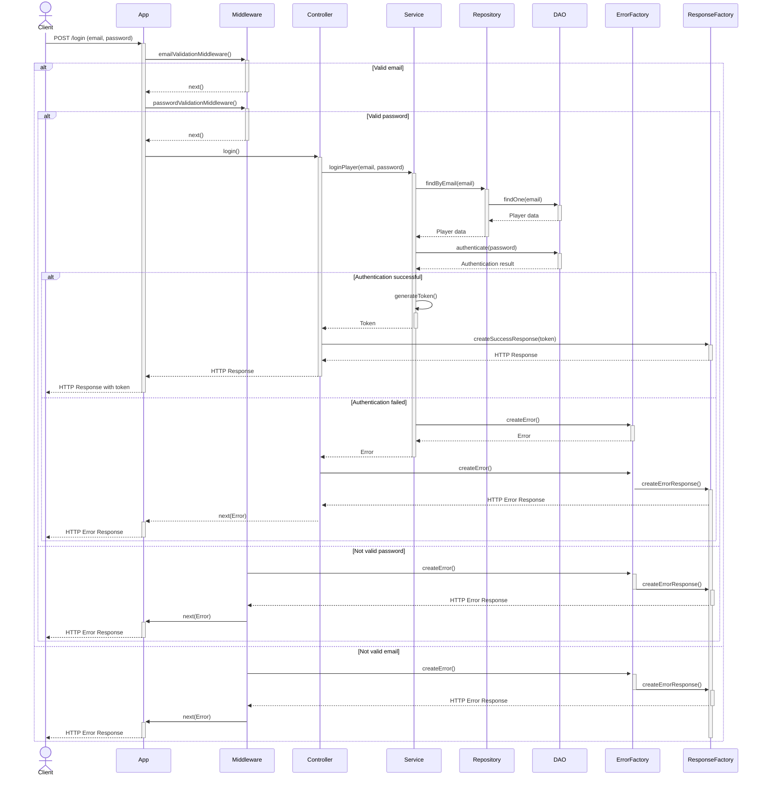
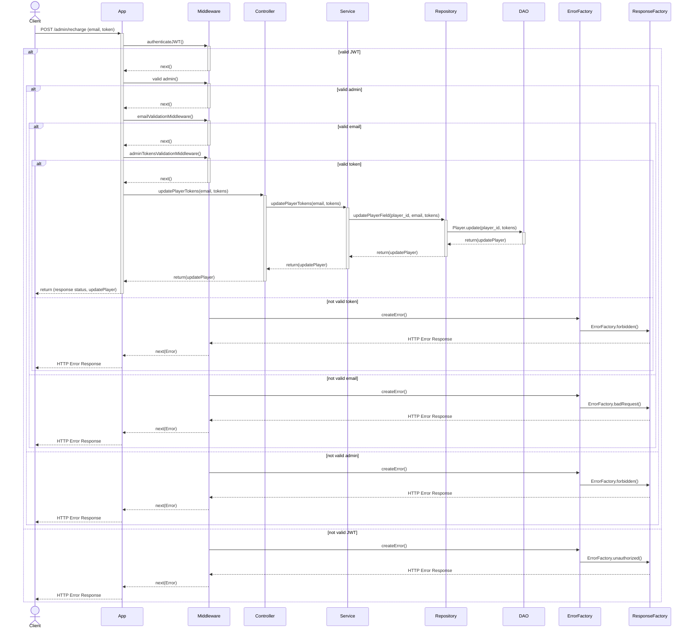
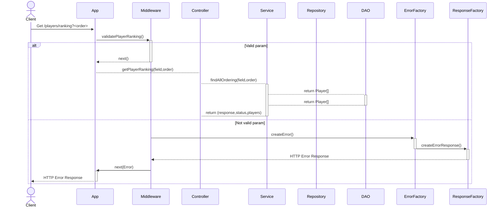

Route login 

```mermaid
sequenceDiagram
    actor Client
    participant App
    participant Middleware
    participant Controller
    participant Service
    participant Repository
    participant DAO
    participant ErrorFactory
    participant ResponseFactory

    Client->>+App: POST /login (email, password)
    App->>+Middleware: emailValidationMiddleware()
    alt Valid email
        Middleware-->>-App: next()
        App->>+Middleware: passwordValidationMiddleware()
        alt Valid password
            Middleware-->>-App: next()
            App->>+Controller: login()
            Controller->>+Service: loginPlayer(email, password)
            Service->>+Repository: findByEmail(email)
            Repository->>+DAO: findOne(email)
            DAO-->>-Repository: Player data
            Repository-->>-Service: Player data
            Service->>+DAO: authenticate(password)
            DAO-->>-Service: Authentication result
            alt Authentication successful
                Service->>+Service: generateToken()
                Service-->>-Controller: Token
                Controller->>+ResponseFactory: createSuccessResponse(token)
                ResponseFactory-->>-Controller: HTTP Response
                Controller-->>-App: HTTP Response
                App-->>-Client: HTTP Response with token
            else Authentication failed
                Service->>+ErrorFactory: createError()
                ErrorFactory-->>-Service: Error
                Service-->>-Controller: Error
                Controller->>+ErrorFactory: createError()
                ErrorFactory->>+ResponseFactory: createErrorResponse()
                ResponseFactory-->>+Controller: HTTP Error Response
                Controller-->>+App: next(Error)
                App-->>-Client: HTTP Error Response
            end
        else Not valid password
            Middleware->>+ErrorFactory: createError()
            ErrorFactory->>+ResponseFactory: createErrorResponse()
            deactivate ErrorFactory
            ResponseFactory-->>-Middleware: HTTP Error Response
            Middleware->>+App: next(Error)
            App-->>-Client: HTTP Error Response
        end
    else Not valid email
        Middleware->>+ErrorFactory: createError()
        ErrorFactory->>+ResponseFactory: createErrorResponse()
        deactivate ErrorFactory
        ResponseFactory-->>-Middleware: HTTP Error Response
        Middleware->>+App: next(Error)
        App-->>-Client: HTTP Error Response
        
        deactivate ResponseFactory
    end
```
Route /admin/update-token

```mermaid
sequenceDiagram
    actor Client
    participant App
    participant Middleware
    participant Controller
    participant Service
    participant Repository
    participant DAO
    participant ErrorFactory
    participant ResponseFactory

    Client->>+App: POST /admin/recharge (email, token)
    App->>+Middleware: authenticateJWT()
    alt valid JWT
        Middleware-->>-App: next()
        App->>+Middleware: valid admin()
        alt valid admin
            Middleware-->>-App: next()
            App->>+Middleware: emailValidationMiddleware()
            alt valid email
                Middleware-->>-App: next()
                App->>+Middleware: adminTokensValidationMiddleware()
                alt valid token
                    Middleware-->>-App: next()
                    App->>+Controller: updatePlayerTokens(email, tokens)
                    Controller->>+Service: updatePlayerTokens(email, tokens)
                    Service->>+Repository: updatePlayerField(player_id, email, tokens)
                    Repository->>+DAO: Player.update(player_id, tokens)
                    DAO-->>-Repository: return(updatePlayer)
                    Repository-->>-Service: return(updatePlayer)
                    Service-->>-Controller: return(updatePlayer)
                    Controller-->>-App: return(updatePlayer)
                    App-->>-Client: return (response status, updatePlayer)
                else not valid token
                    Middleware->>ErrorFactory: createError()
                    ErrorFactory->>ResponseFactory: ErrorFactory.forbidden()
                    ResponseFactory-->>Middleware: HTTP Error Response
                    Middleware-->>App: next(Error)
                    App-->>Client: HTTP Error Response
                end
            else not valid email
                Middleware->>ErrorFactory: createError()
                ErrorFactory->>ResponseFactory: ErrorFactory.badRequest()
                ResponseFactory-->>Middleware: HTTP Error Response
                Middleware-->>App: next(Error)
                App-->>Client: HTTP Error Response
            end
        else not valid admin
            Middleware->>ErrorFactory: createError()
            ErrorFactory->>ResponseFactory: ErrorFactory.forbidden()
            ResponseFactory-->>Middleware: HTTP Error Response
            Middleware-->>App: next(Error)
            App-->>Client: HTTP Error Response
        end
    else not valid JWT
        Middleware->>ErrorFactory: createError()
        ErrorFactory->>ResponseFactory: ErrorFactory.unauthorized()
        ResponseFactory-->>Middleware: HTTP Error Response
        Middleware-->>App: next(Error)
        App-->>Client: HTTP Error Response
    end
```
Route public ranking
http://localhost:3000/players/ranking

```mermaid
sequenceDiagram
    actor Client
    participant App
    participant Middleware
    participant Controller
    participant Service
    participant Repository
    participant DAO
    participant ErrorFactory
    participant ResponseFactory

    Client->>+App: Get /players/ranking?<order>
    App->>+Middleware: validatePlayerRanking()
    alt Valid param
        Middleware-->>-App: next()
        App-->+Controller:getPlayerRanking(field,order)
        Controller-->+Service:findAllOrdering(field,order)
        Service-->+DAO: return Player[]
        DAO-->-Service: return Player[]
        Service-->-Controller: return (response,status,players)
    else Not valid param
        Middleware->>+ErrorFactory: createError()
        ErrorFactory->>+ResponseFactory: createErrorResponse()
        deactivate ErrorFactory
        ResponseFactory-->>-Middleware: HTTP Error Response
        Middleware->>+App: next(Error)
        App-->>-Client: HTTP Error Response
      
    end

```

