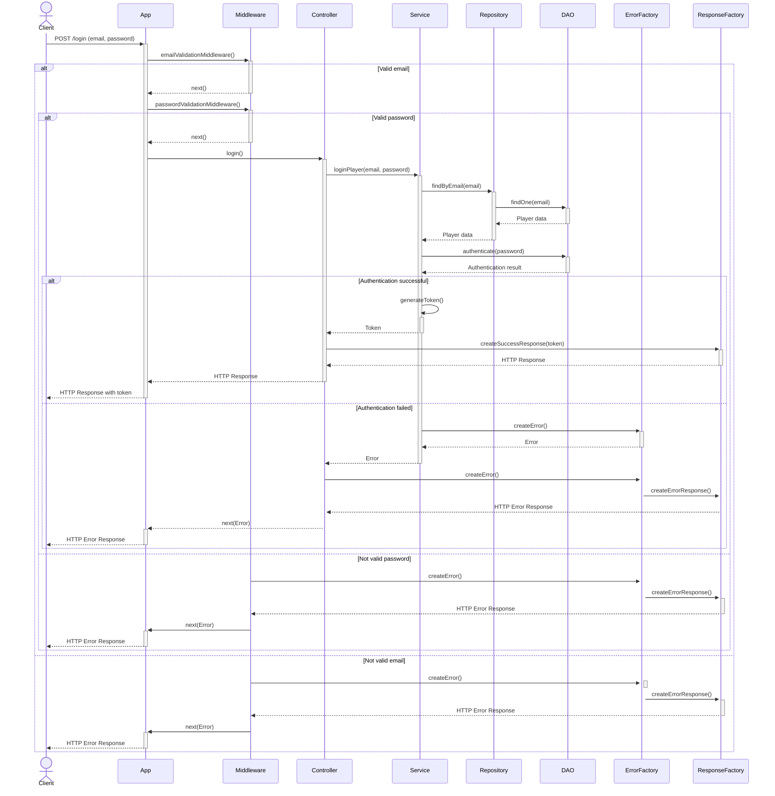

```mermaid
sequenceDiagram
    actor Client
    participant App
    participant Middleware
    participant Controller
    participant Service
    participant Repository
    participant DAO
    participant ErrorFactory
    participant ResponseFactory

    Client->>+App: POST /login (email, password)
    App->>+Middleware: emailValidationMiddleware()
    alt Valid email
        Middleware-->>-App: next()
        App->>+Middleware: passwordValidationMiddleware()
        alt Valid password
            Middleware-->>-App: next()
            App->>+Controller: login()
            Controller->>+Service: loginPlayer(email, password)
            Service->>+Repository: findByEmail(email)
            Repository->>+DAO: findOne(email)
            DAO-->>-Repository: Player data
            Repository-->>-Service: Player data
            Service->>+DAO: authenticate(password)
            DAO-->>-Service: Authentication result
            alt Authentication successful
                Service->>+Service: generateToken()
                Service-->>-Controller: Token
                Controller->>+ResponseFactory: createSuccessResponse(token)
                ResponseFactory-->>-Controller: HTTP Response
                Controller-->>-App: HTTP Response
                App-->>-Client: HTTP Response with token
            else Authentication failed
                Service->>+ErrorFactory: createError()
                ErrorFactory-->>-Service: Error
                Service-->>-Controller: Error
                Controller->>+ErrorFactory: createError()
                ErrorFactory->>+ResponseFactory: createErrorResponse()
                ResponseFactory-->>+Controller: HTTP Error Response
                Controller-->>+App: next(Error)
                App-->>-Client: HTTP Error Response
            end
        else Not valid password
            Middleware->>+ErrorFactory: createError()
            ErrorFactory->>+ResponseFactory: createErrorResponse()
            ResponseFactory-->>-Middleware: HTTP Error Response
            Middleware->>+App: next(Error)
            App-->>-Client: HTTP Error Response
        end
    else Not valid email
        Middleware->>+ErrorFactory: createError()
        deactivate ErrorFactory
        ErrorFactory->>+ResponseFactory: createErrorResponse()
        ResponseFactory-->>-Middleware: HTTP Error Response
        Middleware->>+App: next(Error)
        App-->>-Client: HTTP Error Response
    end
```