<p align="center">
  
</p>

---

<p align="center">


<br>


</p>

<div align="center">
<h1>♟️ Backend system for chess game</h1>
This project implements a robust backend system for chess in <b>TypeScript</b> using <b>Node.js</b>, <b>Express.js</b>, <b>Sequelize</b>, and other modern tools. Developed as part of the Master's Degree in Computer Engineering and Automation (<b>LM-32</b>) at <b>UNIVPM</b> for the 2023-2024 academic year, it showcases the application of professional backend development practices and design patterns.<br>
The system was developed by students <a href="https://github.com/nicolobartolinii">Nicolò Bartolini</a> and <a href="https://github.com/NicolaPicciafuoco">Nicola Picciafuoco</a> for the <b>Advanced Programming</b> course led by Prof. Adriano Mancini.<br>
Detailed project objectives, unique features, and in-depth technical aspects are discussed in the following sections of this README.
</div>

---

# 🇮🇹 [Italian version (versione italiana)](README-it.md)

# 📋 Table of contents

- [🎯 Project goals](#-project-goals)
- [🛠️ Tools used](#-tools-used)
- [🧩 Patterns used](#-patterns-used)
    - [🏗️ Model-Controller (MVC)](#-mvc-model-controller)
    - [🗄️ Data Access Object (DAO)](#-data-access-object-dao)
    - [📦 Repository](#-repository)
    - [🔒 Singleton](#-singleton)
    - [⛓️ Chain of Responsibility](#-chain-of-responsibility)
    - [🏭 Factory Method](#-factory-method)
    - [🔀 Strategy](#-strategy)
- [📚 API Reference](#-api-reference)
    - [POST `/login`](#post-login)
    - [POST `/admin/update-tokens`](#post-adminupdate-tokens)
    - [GET `/players/ranking`](#get-playersranking)
    - [POST `/games`](#post-games)
    - [GET `/games`](#get-games)
    - [GET `/games[/{gameId}]/status`](#get-gamesgameidstatus)
    - [GET `/games/{gameId}/win-certificate`](#get-gamesgameidwin-certificate)
    - [POST `/games/move`](#post-gamesmove)
    - [GET `/games/{gameId}/chessboard`](#get-gamesgameidchessboard)
    - [GET `/games/{gameId}/details`](#get-gamesgameiddetails)
    - [POST `/games/move/abandon`](#post-gamesmoveabandon)
- [📊 UML diagrams](#-uml-diagrams)
    - [Use case diagram](#use-case-diagram)
    - [Sequence diagrams](#sequence-diagrams)
- [🚀 Installation and usage](#-installation-and-usage)
- [🧪 Testing](#-testing)
- [🌟 Additional features](#-additional-features)
- [👥 Authors](#-authors)
- [📄 License](#-license)

# 🎯 Project goals

This project aims to develop a robust and secure backend system for a chess game application, demonstrating advanced
programming concepts and best practices in backend development. The primary objectives are:

1. Implement a **chess game backend system** allowing users to play against AI or other players, integrating
   the [`js-chess-engine`](https://npmjs.com/package/js-chess-engine) library for game logic.
2. Develop a secure **JWT-based asymmetric authentication** system with role-based access control, including admin
   functionality.
3. Create a **token-based economy** for game participation, with specific costs for game creation and moves.
4. Design and implement **RESTful API endpoints** for game management, move making, game state tracking, and other
   functionalities.
5. Implement **data export functionality** in JSON and PDF formats, including victory certificates.
6. Create an unauthenticated **public leaderboard system** with customizable sorting options.
7. Integrate a database using [**Sequelize ORM**](https://sequelize.org/) to store game and user data efficiently.
8. Implement **middleware** for request _validation_, _error handling_, and other cross-cutting concerns.
9. Ensure code quality through **TypeScript** usage, comprehensive _commenting_, and application of various _design
   patterns_.
10. Configure the project for **easy deployment** using [Docker](https://www.docker.com/)
    and [Docker Compose](https://docs.docker.com/compose/).
11. Develop a comprehensive **test suite** using [Postman](https://www.postman.com/)
    and [Newman](https://www.npmjs.com/package/newman) to
    ensure API reliability.
12. Adhere to RESTful API design principles and backend development best practices throughout the project.

This chess game backend system serves as a practical application of advanced programming techniques, showcasing the
ability to create a scalable, maintainable, and feature-rich application in a real-world context.

# 🛠️ Tools used

This project leverages a variety of modern tools and technologies for backend development:

- [Node.js](https://nodejs.org/)
- [Express.js](https://expressjs.com/)
- [TypeScript](https://www.typescriptlang.org/)
- [Sequelize](https://sequelize.org/)
- [PostgreSQL](https://www.postgresql.org/)
- [Docker](https://www.docker.com/) and [Docker Compose](https://docs.docker.com/compose/)
- [js-chess-engine](https://www.npmjs.com/package/js-chess-engine) - JavaScript chess engine for game logic
- [JWT (JSON Web Tokens)](https://jwt.io/)
- [Postman](https://www.postman.com/)
  and [Newman](https://www.npmjs.com/package/newman)
- [PDFKit](https://pdfkit.org/) - PDF generation library for Node.js
- [Mermaid](https://mermaid-js.github.io/mermaid/#/) - Diagramming and charting tool
- [bcryptjs](https://www.npmjs.com/package/bcryptjs)
  and [sequelize-bcrypt](https://www.npmjs.com/package/sequelize-bcrypt) - Password hashing libraries
- [Sharp](https://sharp.pixelplumbing.com/) - High performance Node.js image processing
- [DBeaver](https://dbeaver.io/) - Universal SQL client for relational databases

# 🧩 Patterns used

This project implements several patterns to ensure a robust, maintainable, and
scalable codebase. Each pattern addresses specific challenges in software design and contributes to the overall quality
of the application.

## 🏗️ MVC (Model-Controller)

The **Model-Controller** (**MC**) architectural pattern is used to separate concerns in the application:

- **Models**: represent the data structures and database schema, encapsulating the business logic and data manipulation.
- **Controllers**: handle incoming HTTP requests, process data using the models, and return appropriate responses.

As this is a backend-only project, the traditional **View** layer is omitted, resulting in an MC rather than MVC
structure.

## 🗄️ Data Access Object (DAO)

The **DAO** pattern provides an abstract interface to a database, encapsulating all access logic and exposing methods
for database operations.

#### Implementation

Leveraged through Sequelize ORM
to [define database models](https://github.com/nicolobartolinii/chess-backend/blob/main/src/models) and interact with
the database. This abstraction simplifies database integration and allows for easier switching between different
database systems if needed.

## 📦 Repository

The **Repository** pattern mediates between the domain and data mapping layers, acting like an in-memory collection of
domain objects. This pattern centralizes data access logic, improving maintainability and allowing for easier
implementation of caching or data retrieval strategies.

#### Implementation

Defines [methods for database queries and interactions](https://github.com/nicolobartolinii/chess-backend/blob/main/src/repositories),
working with Sequelize models (DAO) to provide a clean functionality for data access.

## 🔒 Singleton

The [Singleton](https://refactoring.guru/design-patterns/singleton) creational pattern ensures a class has only one
instance and provides a global point of access to it.

<p align="center">
    
</p>

*Image source: [Refactoring Guru](https://refactoring.guru/design-patterns/singleton),
with [permission](https://refactoring.guru/content-usage-policy)

#### Implementation

Used for
managing [database connections](https://github.com/nicolobartolinii/chess-backend/blob/main/src/db/sequelizeConnection.ts),
ensuring that only one connection pool is maintained throughout the application lifecycle. This optimizes resource usage
and provides a consistent interface for database operations.

## ⛓️ Chain of Responsibility

The [Chain of Responsibility](https://refactoring.guru/design-patterns/chain-of-responsibility) behavioral pattern
passes requests along a chain of handlers, allowing multiple objects to handle the request without coupling sender to
receiver.

<p align="center">
    
</p>

*Image source: [Refactoring Guru](https://refactoring.guru/design-patterns/chain-of-responsibility),
with [permission](https://refactoring.guru/content-usage-policy)

#### Implementation

Utilized through [Express.js middleware system](https://expressjs.com/en/guide/using-middleware.html), where each
middleware function can process the request, perform specific tasks (e.g., authentication, validation, error handling),
and
decide whether to pass it to the next handler in the chain. This creates a flexible and extensible request processing
pipeline.

In our project, the Chain of Responsibility pattern is applied to
handle [request validation, authentication, and error handling](https://github.com/nicolobartolinii/chess-backend/blob/main/src/middlewares)
in a modular and composable manner.

## 🏭 Factory Method

The [Factory Method](https://refactoring.guru/design-patterns/factory-method) creational pattern provides an interface
for creating objects in a superclass, allowing subclasses to alter the type of objects created.

<p align="center">
    
</p>

*Image source: [Refactoring Guru](https://refactoring.guru/design-patterns/factory-method),
with [permission](https://refactoring.guru/content-usage-policy)

#### Implementation

- [`ResponseFactory`](https://github.com/nicolobartolinii/chess-backend/blob/main/src/factories/responseFactory.ts):
  creates standardized JSON responses, ensuring consistency across the API.
- [`ErrorFactory`](https://github.com/nicolobartolinii/chess-backend/blob/main/src/factories/errorFactory.ts): generates
  consistent error structures, facilitating uniform error handling and reporting.

This approach centralizes object creation logic and makes it easier to modify or extend response and error handling in
the future.

## 🔀 Strategy

The [Strategy](https://refactoring.guru/design-patterns/strategy) behavioral pattern defines a family of algorithms,
encapsulates each one, and makes them interchangeable.

<p align="center">
    
</p>

*Image source: [Refactoring Guru](https://refactoring.guru/design-patterns/strategy),
with [permission](https://refactoring.guru/content-usage-policy)

#### Implementation

Used
for [exporting game move history in different formats](https://github.com/nicolobartolinii/chess-backend/blob/main/src/strategies):

- `JSONExportStrategy`: handles exporting in JSON format.
- `PDFExportStrategy`: manages exporting in PDF format.

This pattern allows for easy extension to support additional export formats in the future without modifying existing
code.

# 📚 API Reference

| HTTP Verb | Endpoint                                                             | Description                                       | JWT Authentication |
|-----------|----------------------------------------------------------------------|---------------------------------------------------|:------------------:|
| POST      | [`/login`](#post-login)                                              | Authenticate user                                 |         ❌          |
| POST      | [`/admin/update-tokens`](#post-adminupdate-tokens)                   | Recharge user's credits (admin only)              |         ✅          |
| GET       | [`/players/ranking`](#get-playersranking)                            | Retrieve player rankings by score                 |         ❌          |
| POST      | [`/games`](#post-games)                                              | Create a new chess match                          |         ✅          |
| GET       | [`/games`](#get-games)                                               | Retrieve user's completed match history           |         ✅          |
| GET       | [`/games[/{gameId}]/status`](#get-gamesgameidstatus)                 | Retrieve current status of a specific chess game  |         ✅          |
| GET       | [`/games/{gameId}/win-certificate`](#get-gamesgameidwin-certificate) | Generate victory certificate for a match          |         ✅          |
| POST      | [`/game/move`](#post-gamesmove)                                      | Make a move in the current active game            |         ✅          |
| GET       | [`/games/{gameId}/chessboard`](#get-gamesgameidchessboard)           | Retrieve the latest game chessboard configuration |         ✅          |
| GET       | [`/games/{gameId}/details`](#get-gamesgameiddetails)                 | Retrieve game details (PDF or JSON format)        |         ✅          |
| POST      | [`/games/move/abandon`](#post-gamesmoveabandon)                      | Forfeit a match                                   |         ✅          |

## POST `/login`

The POST `/login` endpoint is used to authenticate a user. The user must provide an email and a password in the request
body. The email is used to find the player in the database and the password is used to authenticate the player. If the
player is successfully authenticated, a JWT token is generated and returned to the player in order to authenticate
future requests.

### Parameters

| Location     | Name       | Type     | Description          | Required |
|--------------|------------|----------|----------------------|:--------:|
| Request body | `email`    | `string` | User's email address |    ✅     |
| Request body | `password` | `string` | User's password      |    ✅     |

### Request example

```http
POST /login HTTP/1.1
Content-Type: application/json

{
  "email": "email@example.com",
  "password": "password"
}
```

### Response example

```json
{
  "token": "eyJhbGciOiJIUzI1NiIsInR5cCI6IkpXVCJ9.eyJwYXlsb2FkIjoiZm9vIiwiaWF0IjoxNjI5MzUwNzQ4LCJleHAiOjE2MjkzNTA3NDh9.7"
}
```

## POST `/admin/update-tokens`

The POST `/admin/update-tokens` endpoint allows an admin user to update the tokens of a player. The admin must provide
the email of the player and the number of tokens to add or remove in the request body. A valid JWT token with admin
privileges is required to authenticate the request.

### Parameters

| Location     | Name     | Type     | Description                          | Required |
|--------------|----------|----------|--------------------------------------|:--------:|
| Request body | `email`  | `string` | Email of the player to update tokens |    ✅     |
| Request body | `tokens` | `number` | Number of tokens to add or remove    |    ✅     |

### Request example

```http
POST /admin/update-tokens HTTP/1.1
Content-Type: application/json
Authorization: Bearer <JWT token>

{
  "email": "email@example.com",
  "tokens": 10
}
```

### Response example

```json
{
  "success": true,
  "statusCode": 201,
  "message": "Player tokens updated successfully",
  "data": {
    "player_id": 2,
    "username": "franco",
    "email": "franco@giovanni.it",
    "tokens": "10.0000",
    "role": 0
  }
}
```

## GET `/players/ranking`

The GET `/players/ranking` endpoint retrieves the player rankings based on the number of points they have. The client
can specify the field by which the ranking is to be ordered and the order of the sort. No JWT token is required for this
endpoint.

### Parameters

| Location      | Name    | Type     | Description                                                               | Accepted values | Required |
|---------------|---------|----------|---------------------------------------------------------------------------|-----------------|:--------:|
| Request query | `field` | `string` | The field by which the ranking is to be ordered. Default value: `points`. | `points`        |    ❌     |
| Request query | `order` | `string` | The direction of the sort. Default value: `desc`.                         | `asc`, `desc`   |    ❌     |

### Request example

```http
GET /players/ranking?field=points&order=desc HTTP/1.1
```

### Response example

```json
{
  "success": true,
  "statusCode": 200,
  "message": "Players retrieved successfully",
  "data": [
    {
      "player_id": 1,
      "username": "prova",
      "email": "prova@prova.it",
      "points": "0.0000",
      "tokens": "10.0000"
    },
    {
      "player_id": 2,
      "username": "franco",
      "email": "franco@giovanni.it",
      "points": "1.0000",
      "tokens": "8.1000"
    }
  ]
}
```

## POST `/games`

The POST `/games` endpoint allows users to create a new chess game. The user must provide either the email of the
opponent or the difficulty level of the AI opponent in the request body. A valid JWT token in the Authorization header
is required to authenticate the request.

### Parameters

| Location     | Name             | Type     | Description                         | Accepted values                                                 | Required |
|--------------|------------------|----------|-------------------------------------|-----------------------------------------------------------------|:--------:|
| Request body | `player_2_email` | `string` | Email of the human opponent         | Valid email address                                             |    *     |
| Request body | `AI_difficulty`  | `string` | Difficulty level of the AI opponent | `MONKEY`, `BEGINNER`, `INTERMEDIATE`, `ADVANCED`, `EXPERIENCED` |    *     |

\* Either `email` or `AI_difficulty` must be provided, but not both.

### Request example

```http
POST /games HTTP/1.1
Content-Type: application/json
Authorization: Bearer <JWT token>

{
  "player_2_email": "opponent@example.com"
}
```

### Response example

```json
{
  "success": true,
  "statusCode": 201,
  "message": "Game created successfully",
  "data": {
    "game_id": 3,
    "player_1_id": 1,
    "player_2_id": null,
    "AI_difficulty": "MONKEY",
    "game_status": "ACTIVE",
    "start_date": "2024-07-15T07:55:51.091Z"
  }
}
```

## GET `/games`

The GET `/games` endpoint retrieves the finished games history of the authenticated user, sorted by the start date in
ascending or descending order. The client can specify the start date from which to retrieve the game history and the
order of the sort. A valid JWT token in the Authorization header is required to authenticate the request.

### Parameters

| Location      | Name         | Type     | Description                                                                    | Accepted values             | Required |
|---------------|--------------|----------|--------------------------------------------------------------------------------|-----------------------------|:--------:|
| Request query | `start_date` | `string` | The date from which to retrieve the game history. Default value: `1970-01-01`. | Date in `YYYY-MM-DD` format |    ❌     |
| Request query | `order`      | `string` | The direction of the sort. Default value: `desc`.                              | `asc`, `desc`               |    ❌     |

### Request example

```http
GET /games?start_date=2024-07-10&order=desc HTTP/1.1
Authorization: Bearer <JWT token>
```

### Response example

```json
{
  "success": true,
  "statusCode": 200,
  "message": "Games history retrieved successfully",
  "data": [
    {
      "game_id": 2,
      "game_status": "FINISHED",
      "number_of_moves": 11,
      "start_date": "2024-07-10T08:26:51.998Z",
      "winner_id": 2,
      "result": "You are the winner."
    }
  ]
}
```

## GET `/games[/{gameId}]/status`

The GET `/games[/{gameId}]/status` endpoint retrieves the current status of a specific chess game. The client can
provide the game ID in the URL to identify the game. In this case, the client must be part of the game. If the gameId is
not provided, the status of the current active game is returned. A valid JWT token in the Authorization header is
required to authenticate the request.

### Parameters

| Location | Name     | Type     | Description                                                                                                         | Required |
|----------|----------|----------|---------------------------------------------------------------------------------------------------------------------|:--------:|
| URL      | `gameId` | `number` | The ID of the game for which to retrieve the status. If omitted, the status of the current active game is returned. |    ❌     |

### Request example

```http
GET /games/2/status HTTP/1.1
Authorization: Bearer <JWT token>
```

### Response example

```json
{
  "success": true,
  "statusCode": 200,
  "message": "Game status retrieved successfully",
  "data": {
    "game_id": 2,
    "status": "FINISHED",
    "current_configuration": {
      "moves": {},
      "pieces": {
        "E1": "K",
        "...": "...",
        "F8": "Q"
      },
      "turn": "black",
      "isFinished": true,
      "check": true,
      "checkMate": true,
      "castling": {
        "whiteShort": true,
        "blackShort": false,
        "whiteLong": true,
        "blackLong": false
      },
      "enPassant": null,
      "halfMove": 4,
      "fullMove": 6
    },
    "opponent": 1,
    "winner_id": 2,
    "result": "You are the winner."
  }
}
```

## GET `/games/{gameId}/win-certificate`

The GET `/games/{gameId}/win-certificate` endpoint retrieves a certificate of victory for a specific chess game in the
PDF format. The client must provide the game ID in the URL to identify the game, the player must be the winner of the
game, and must be authenticated with a valid JWT token.

### Parameters

| Location | Name     | Type     | Description                                          | Required |
|----------|----------|----------|------------------------------------------------------|:--------:|
| URL      | `gameId` | `number` | The ID of the game for which to retrieve the status. |    ✅     |

### Request example

```http
GET /games/2/win-certificate HTTP/1.1
Authorization: Bearer <JWT token>
```

### Response example

[Here](README-assets/win_certificate_example.pdf) is an example of a win certificate in PDF format. Below, a screenshot
of that certificate:

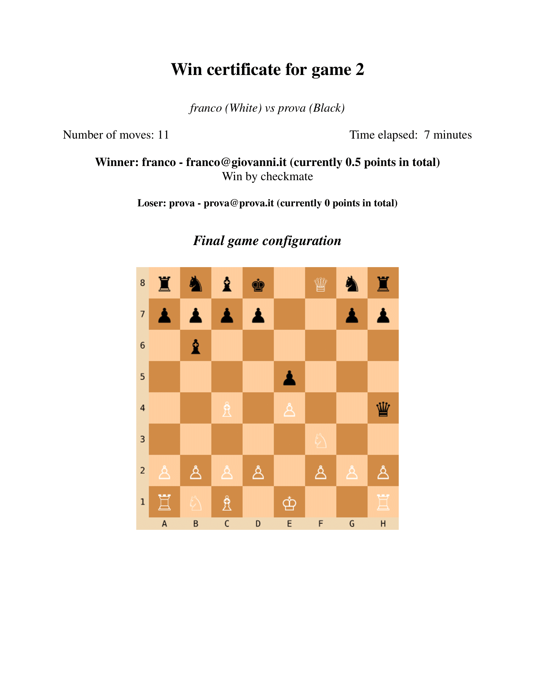

## POST `/games/move`

The POST `/games/move` endpoint allows player to make a move in the current active chess game. The user must provide the
move starting and ending positions in the request body. The user must also provide a JWT token in the
Authorization header to authenticate the request.

### Parameters

| Location     | Name   | Type     | Description                        | Required |
|--------------|--------|----------|------------------------------------|:--------:|
| Request body | `from` | `string` | The starting position of the move. |    ✅     |
| Request body | `to`   | `string` | The ending position of the move.   |    ✅     |

### Request example

```http
POST /games/move HTTP/1.1
Content-Type: application/json
Authorization: Bearer <JWT token>

{
  "from": "C2",
  "to": "C4"
}
```

### Response example

```json
{
  "success": true,
  "statusCode": 201,
  "message": "Move made successfully",
  "data": {
    "move": "You moved a White Pawn from C2 to C4. AI moved a Black Knight from F6 to E4."
  }
}
```

## GET `/games/{gameId}/chessboard`

The GET `/games/{gameId}/chessboard` endpoint retrieves the latest board configuration of a specific chess game. The
client must provide the game ID in the URL to identify the game, the player must be part of the game. A valid JWT token
in the Authorization header is required to authenticate the request.

### Parameters

| Location | Name     | Type     | Description                                          | Required |
|----------|----------|----------|------------------------------------------------------|:--------:|
| URL      | `gameId` | `number` | The ID of the game for which to retrieve the status. |    ✅     |

### Request example

```http
GET /games/2/chessboard HTTP/1.1
Authorization: Bearer <JWT token>
```

### Response example

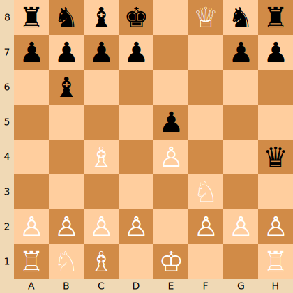

## GET `/games/{gameId}/details`

The GET `/games/{gameId}/details` endpoint retrieves the details of a specific chess game in either JSON or PDF format.
The player must be part of the game. The client must provide the game ID in the URL to identify the game. A valid JWT
token in the Authorization header is required to authenticate the request.

### Parameters

| Location      | Name     | Type     | Description                                                         | Accepted values  | Required |
|---------------|----------|----------|---------------------------------------------------------------------|------------------|:--------:|
| URL           | `gameId` | `number` | The ID of the game for which to retrieve the status.                | Numeric game IDs |    ✅     |
| Request query | `format` | `string` | The format in which to retrieve the details. Default value: `json`. | `json`, `pdf`    |    ❌     |

### Request example

```http
GET /games/2/details?format=pdf HTTP/1.1
Authorization: Bearer <JWT token>
```

### Response example (JSON)

```json
[
  {
    "player_name": "franco",
    "game_id": 2,
    "move_number": 1,
    "from_position": "E2",
    "to_position": "E4",
    "player_id": 2,
    "configuration_after": {
      "turn": "black",
      "check": false,
      "moves": {
        "A7": [
          "A6",
          "A5"
        ],
        "...": [
          "..."
        ]
      },
      "pieces": {
        "...": "..."
      },
      "castling": {
        "blackLong": true,
        "whiteLong": true,
        "blackShort": true,
        "whiteShort": true
      },
      "fullMove": 1,
      "halfMove": 0,
      "checkMate": false,
      "enPassant": "E3",
      "isFinished": false
    },
    "piece": "White Pawn",
    "moveEffect": "",
    "time_elapsed": "126h 56m 23s"
  },
  "...",
  {
    "player_name": "franco",
    "game_id": 2,
    "move_number": 11,
    "from_position": "F7",
    "to_position": "F8",
    "player_id": 2,
    "configuration_after": {
      "turn": "black",
      "check": true,
      "moves": {},
      "pieces": {
        "...": "..."
      },
      "castling": {
        "blackLong": false,
        "whiteLong": true,
        "blackShort": false,
        "whiteShort": true
      },
      "fullMove": 6,
      "halfMove": 4,
      "checkMate": true,
      "enPassant": null,
      "isFinished": true
    },
    "piece": "White Queen",
    "moveEffect": "CHECKMATE",
    "time_elapsed": "20s"
  }
]
```

### Response example (PDF)

[Here](README-assets/game_details_example.pdf) is an example of a game history in PDF format. Below, a screenshot of
that PDF:

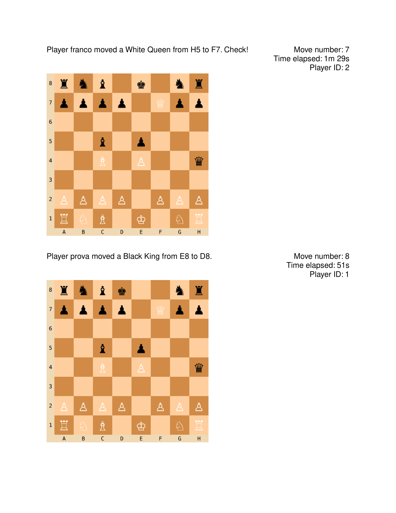

## POST `/games/move/abandon`

The POST `/games/move/abandon` endpoint allows a player to abandon the currently active game. The player must be
authenticated, and it must be the player's turn. The game is marked as abandoned (finished) and the
winner is the other player. The player who abandons the game loses 0.5 points and the winner gains 1 point. A valid JWT
token in the Authorization header is required to authenticate the request.

### Parameters

This endpoint does not require any parameters.

### Request example

```http
POST /games/move/abandon HTTP/1.1
Authorization: Bearer <JWT token>
```

### Response example

```json
{
  "success": true,
  "statusCode": 201,
  "message": "Game abandoned. You lost!"
}
```

# 📊 UML diagrams

## Use case diagram

The following use case diagram illustrates the interactions between the actors and the system in this web application.

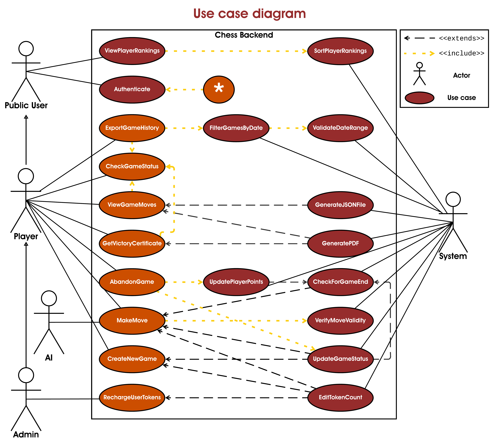

\* The use case marked with an asterisk (*) represents all the use cases that include the JWT token authentication.
Every `<<include>>` relationship with the `Authenticate` use case indicates that the JWT token is required to access the
specific functionality. The multiple `<<include>>` relationships with the `Authenticate` use case have been omitted for
clarity.

## Sequence diagrams

The sequence diagrams below illustrate the interactions between the client, the application, and the various components
involved in the major endpoints of the application.

### POST `/login`

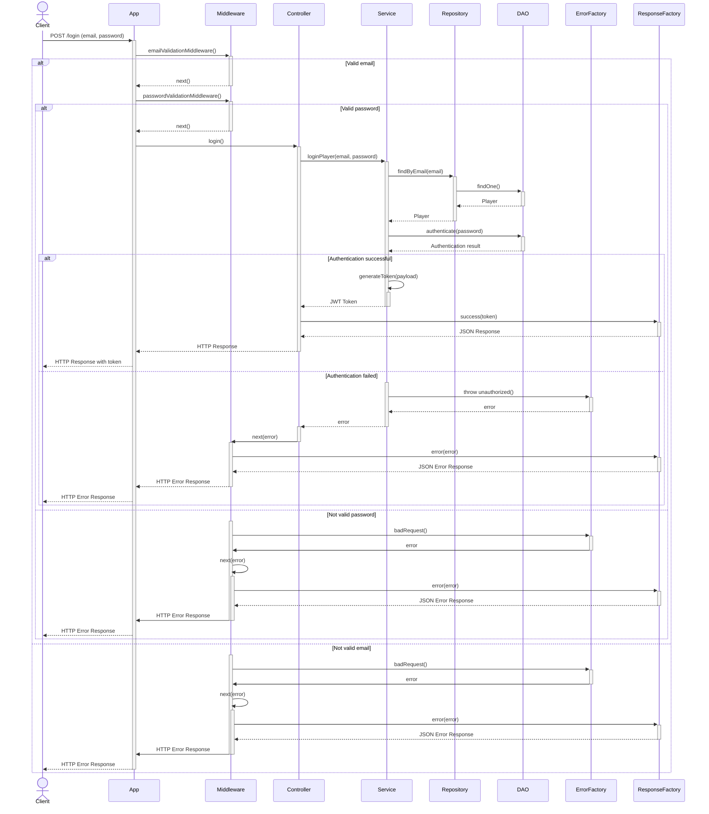

### POST `/admin/update-tokens`

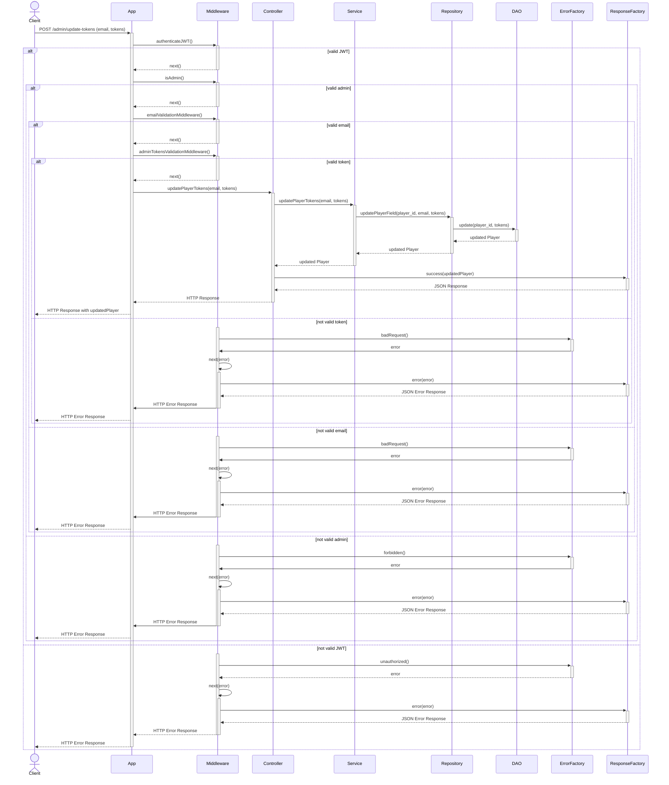

### GET `/players/ranking`

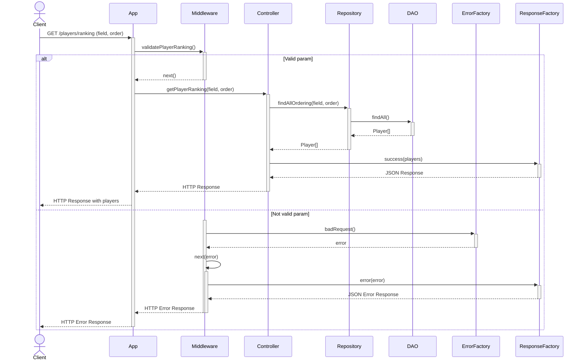

### GET `/games`

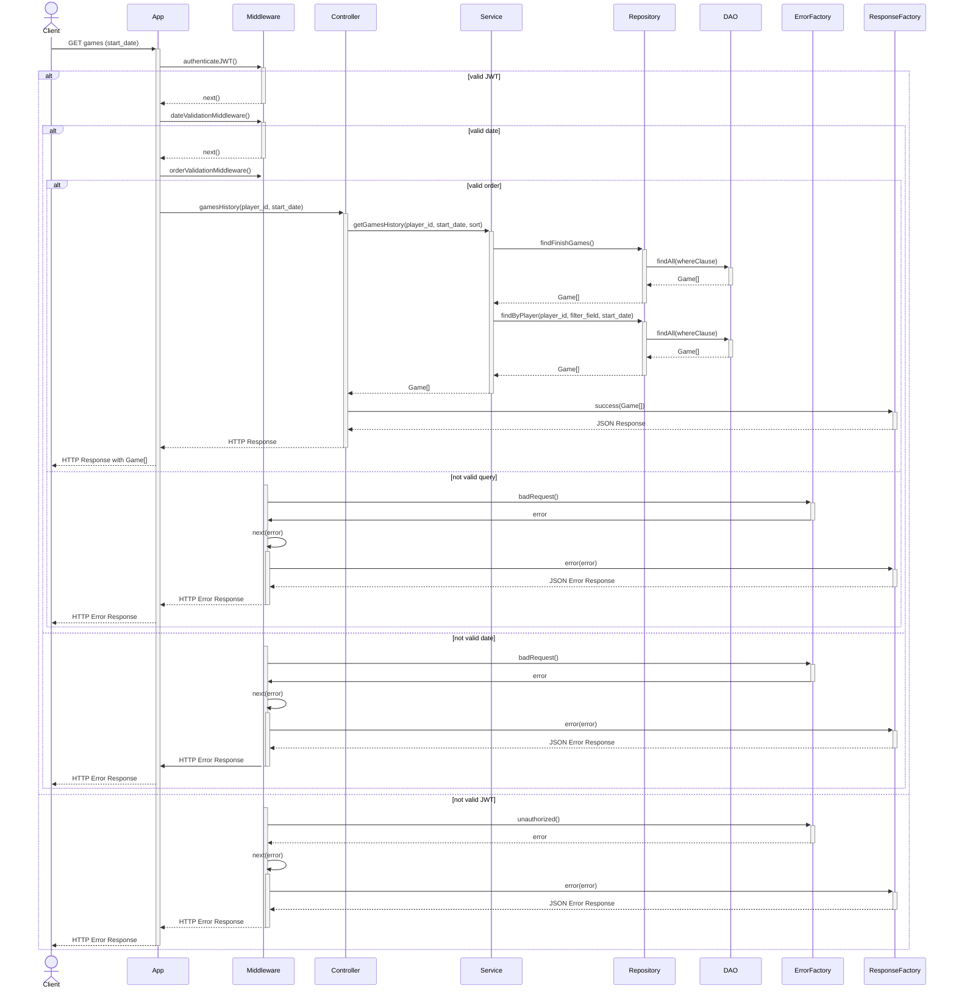

### POST `/games`

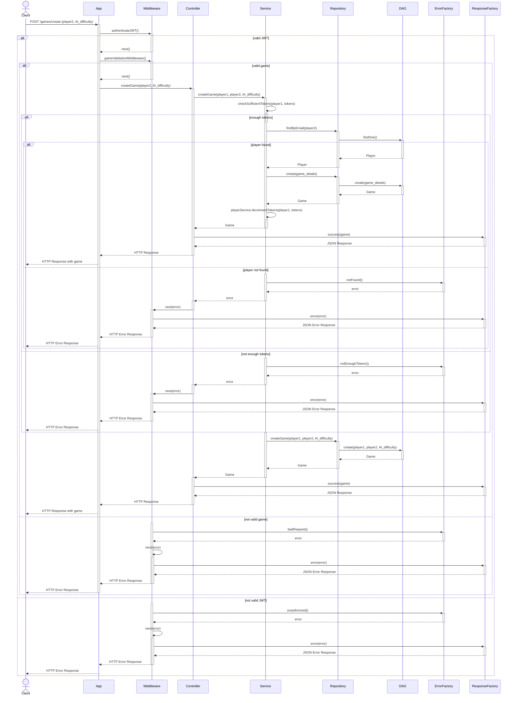

### GET `/games/{gameId}/win-certificate`

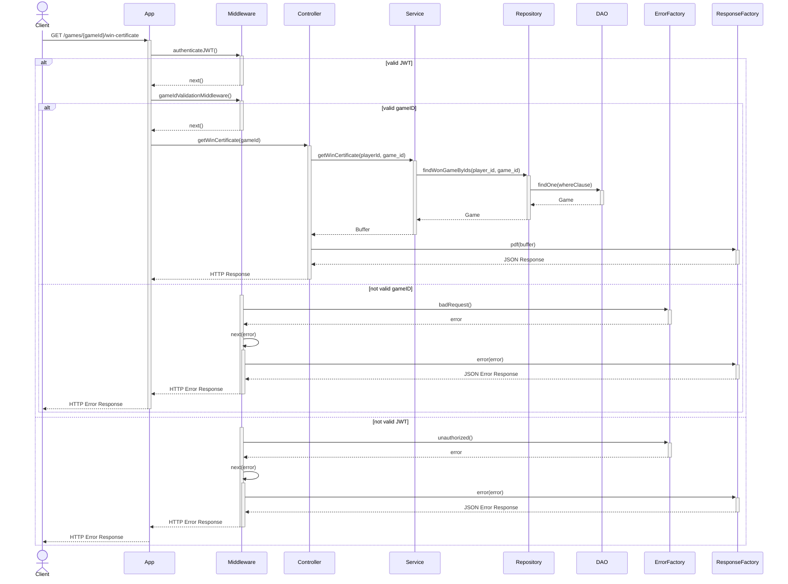

### GET `/games/{gameId}/details`

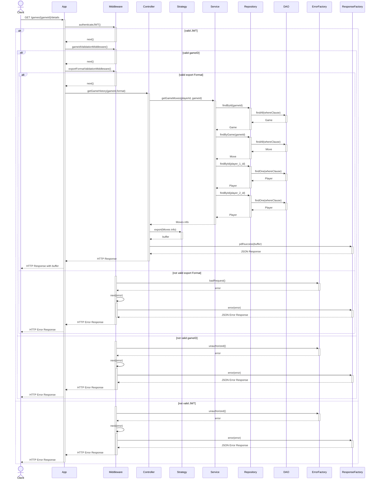

# 🚀 Installation and usage

A step-by-step guide for setting up the project using Docker is provided in this section.

**Note:** The described steps have been written for a Unix-based operating system. Some commands may differ for Windows.

### Prerequisites

The following tools are required to be installed for building and running the project:

- [Git](https://git-scm.com/downloads) - for repository cloning.
- [Docker](https://www.docker.com/get-started) - for container building and running.
- [Docker Compose](https://docs.docker.com/compose/install/) - for the orchestration of the two services of the
  application.
- [SSH](https://www.ssh.com/ssh/command/) and [OpenSSL](https://www.openssl.org/) - for JWT key pair generation.

### Step 1: Repository cloning

The repository should be cloned to the desired location on the local machine:

```bash
https://github.com/nicolobartolinii/chess-backend.git
cd chess-backend
```

### Step 2: Environment configuration

A `.env` file should be created in the root directory of the project.
The sample from the provided [`.env.example`](https://github.com/nicolobartolinii/chess-backend/blob/main/.env.example)
file can be copied
and the variables should be adjusted according to the environment needs:

```bash
cp .env.example .env
```

### Step 3: Private key and public key creation

A private key and a public key files should be created in the root directory of the project. It can be done with the
following commands:

#### For the private key

```bash
ssh-keygen -t rsa -b 4096 -m PEM -f jwtRS256.key
```

#### For the public key

```bash
openssl rsa -in jwtRS256.key -pubout -outform PEM -out jwtRS256.key.pub
```

**Note:** The public key file provided in the repository is a placeholder and should be replaced with the generated one.

### Step 4: Docker images building

With Docker and Docker Compose installed, the Docker images for the project should be built.
In this step, the code is compiled, dependencies are installed, and everything needed to run the application is
prepared.
The following command should be run in the project's root directory:

```bash
docker-compose build
```

### Step 5: Running the application

```bash
docker-compose up -d 
```

The `-d` flag allows the containers to be run in the background, so the terminal can continue to be used.

**Note:** Even after the first run, the application may take a few moments to be fully operational. This is because it
needs to install the dependencies and set up the database.

### Step 6: Installation verification

To ensure everything is set up correctly, the status of the containers can be checked:

```bash
docker-compose ps
```

### Step 7: Application access

Finally, the application can be accessed via a web browser or via Postman. The application should be available at:

```bash
http://localhost:<APPLICATION_PORT>/
```

The default port for the application is 3000. It can be changed in the `.env` file.

### Default users

Starting the application using `NODE_ENV=development` in the `.env` file will create four default users:

- prova@prova.it (password: prova) - Standard player
- franco@giovanni.it (password: franco) - Admin
- test@test.it (password: test) - Admin
- test2@test.it (password: test2) - Standard player

To run seeders using, instead, `NODE_ENV=production` in the `.env` file, the following command should be executed:

```bash
docker-compose exec api npm run seed
```

# 🧪 Testing

The project includes a comprehensive test suite for every API endpoints. That test suite covers almost every possible
response (e.g., success, bad request, unauthorized, forbidden, not found, etc.) and checks the correctness of the
responses.

**Note:** The tests have been written to be run immediately after the application has been started because they require
a clean database. If the application has been running for a while, the tests may fail due to the existing data in the
database.

Before running the tests, Newman must be installed. It can be globally installed with the following command:

```bash
npm install -g newman
```

To run the tests, the following command should be executed in the project's root directory:

```bash
newman run api-tests/api-tests-collection.json -e api-tests/api-tests-environment.json
```

## Test results

Running the tests (before performing any manual operations in the application) should result in the following output:

```bash
┌─────────────────────────┬───────────────────┬──────────────────┐
│                         │          executed │           failed │
├─────────────────────────┼───────────────────┼──────────────────┤
│              iterations │                 1 │                0 │
├─────────────────────────┼───────────────────┼──────────────────┤
│                requests │                68 │                0 │
├─────────────────────────┼───────────────────┼──────────────────┤
│            test-scripts │                62 │                0 │
├─────────────────────────┼───────────────────┼──────────────────┤
│      prerequest-scripts │                40 │                0 │
├─────────────────────────┼───────────────────┼──────────────────┤
│              assertions │               320 │                0 │
├─────────────────────────┴───────────────────┴──────────────────┤
│ total run duration: 6.7s                                       │
├────────────────────────────────────────────────────────────────┤
│ total data received: 505.44kB (approx)                         │
├────────────────────────────────────────────────────────────────┤
│ average response time: 24ms [min: 2ms, max: 791ms, s.d.: 97ms] │
└────────────────────────────────────────────────────────────────┘
```

# 🌟 Additional features

The project includes enhancements beyond the requirements provided by the teacher to improve user experience and
functionality.

### Chessboard visualization

- **Endpoint:** [GET /games/{gameId}/chessboard](#get-gamesgameidchessboard)
- **Function:** Returns a SVG image of the latest chessboard state for a specific game
- **Integrations:**
    - Included in [victory certificates](#get-gamesgameidwin-certificate)
    - Incorporated in PDF exports of [game details](#get-gamesgameiddetails)

This additional feature enhances data presentation and improves the understanding of game progression. We built it to
make testing and debugging easier.

# 👥 Authors

The contributors to this project are:

#### [Nicolò Bartolini](https://github.com/nicolobartolinii) (Matricola 1118768)

#### [Nicola Picciafuoco](https://github.com/NicolaPicciafuoco) (Matricola 1118755)

# 📄 License

[MIT License](LICENSE)

Copyright © 2024 Nicolò Bartolini, Nicola Picciafuoco