<p align="center">
  
</p>

---

<p align="center">


<br>


</p>

<div align="center">
<h1>Backend system for chess game</h1>
This project implements a robust backend system for chess in <b>TypeScript</b> using <b>Node.js</b>, <b>Express.js</b>, <b>Sequelize</b>, and other modern tools. Developed as part of the Master's Degree in Computer Engineering and Automation (<b>LM-32</b>) at <b>UNIVPM</b> for the 2023-2024 academic year, it showcases the application of professional backend development practices and design patterns.<br>
The system was developed by students <a href="https://github.com/nicolobartolinii">Nicolò Bartolini</a> and <a href="https://github.com/NicolaPicciafuoco">Nicola Picciafuoco</a> for the <b>Advanced Programming</b> course led by Prof. Adriano Mancini.<br>
Detailed project objectives, unique features, and in-depth technical aspects are discussed in the following sections of this README.
</div>

---

# Table of contents

- [Project goals](#project-goals)
- [Tools used](#tools-used)
- [Patterns used](#patterns-used)
  - [Model-Controller (MVC)](#mvc-model-controller)
  - [Data Access Object (DAO)](#data-access-object-dao)
  - [Repository](#repository)
  - [Singleton](#singleton)
  - [Chain of Responsibility](#chain-of-responsibility)
  - [Factory Method](#factory-method)
  - [Strategy](#strategy)
- [Endpoints](#endpoints)
  - [POST `/login`](#post-login)
  - [GET `/players/ranking`](#get-playersrankingfieldpointsorderdescasc)
  - [POST `/games`](#post-games)
  - [GET `/games`](#get-gamesstart_dateaaaa-mm-ddorderdescasc)
  - [GET `/games/:gameId/status`](#get-gamesgameidstatus)
  - [GET `/games/:gameId/win-certificate`](#get-gamesgameidwin-certificate)
  - [POST `/games/:gameId/moves`](#post-gamesgameidmoves)
  - [GET `/games/:gameId/board`](#get-gamesgameidboard)
  - [GET `/games/:gameId/details`](#get-gamesgameiddetails)
  - [POST `/games/:gameId/abandon`](#post-gamesgameidabandon)
- [UML diagrams](#umldiagrams)
  - [uses case](#usecase)
  - [sequenzadiagrams](#sequenzadiagrams)
- [Installation](#installation)
- [Additional features](#additional-features)
- [Contributing](#contributing)
- [License](#license)

# Project goals

This project aims to develop a robust and secure backend system for a chess game application, demonstrating advanced programming concepts and best practices in backend development. The primary objectives are:

1. Implement a **chess game backend system** allowing users to play against AI or other players, integrating the [`js-chess-engine`](https://npmjs.com/package/js-chess-engine) library for game logic.
2. Develop a secure **JWT-based asymmetric authentication** system with role-based access control, including admin functionality.
3. Create a **token-based economy** for game participation, with specific costs for game creation and moves.
4. Design and implement **RESTful API endpoints** for game management, move making, game state tracking, and other functionalities.
5. Implement **data export functionality** in JSON and PDF formats, including victory certificates.
6. Create an unauthenticated **public leaderboard system** with customizable sorting options.
7. Integrate a database using [**Sequelize ORM**](https://sequelize.org/) to store game and user data efficiently.
8. Implement **middleware** for request _validation_, _error handling_, and other cross-cutting concerns.
9. Ensure code quality through **TypeScript** usage, comprehensive _commenting_, and application of various _design patterns_.
10. Configure the project for **easy deployment** using [Docker](https://www.docker.com/) and [Docker Compose](https://docs.docker.com/compose/).
11. Develop a comprehensive **test suite** using [Postman](https://www.postman.com/) and [Newman](https://learning.postman.com/docs/collections/using-newman-cli/command-line-integration-with-newman/) to ensure API reliability.
12. Adhere to RESTful API design principles and backend development best practices throughout the project.

This chess game backend system serves as a practical application of advanced programming techniques, showcasing the ability to create a scalable, maintainable, and feature-rich application in a real-world context.

# Tools used

This project leverages a variety of modern tools and technologies for backend development:

- [Node.js](https://nodejs.org/)
- [Express.js](https://expressjs.com/)
- [TypeScript](https://www.typescriptlang.org/)
- [Sequelize](https://sequelize.org/)
- [PostgreSQL](https://www.postgresql.org/)
- [Docker](https://www.docker.com/) and [Docker Compose](https://docs.docker.com/compose/)
- [js-chess-engine](https://www.npmjs.com/package/js-chess-engine) - JavaScript chess engine for game logic
- [JWT (JSON Web Tokens)](https://jwt.io/)
- [Postman](https://www.postman.com/) and [Newman](https://learning.postman.com/docs/collections/using-newman-cli/command-line-integration-with-newman/)
- [PDFKit](https://pdfkit.org/) - PDF generation library for Node.js
- [Mermaid](https://mermaid-js.github.io/mermaid/#/) - Diagramming and charting tool
- [bcryptjs](https://www.npmjs.com/package/bcryptjs) and [sequelize-bcrypt](https://www.npmjs.com/package/sequelize-bcrypt) - Password hashing libraries
- [Sharp](https://sharp.pixelplumbing.com/) - High performance Node.js image processing

Certamente, ecco una versione leggermente più dettagliata della sezione "Patterns Used":


# Patterns used

This project implements several design patterns and two architectural patterns to ensure a robust, maintainable, and scalable codebase. Each pattern addresses specific challenges in software design and contributes to the overall quality of the application.

## MVC (Model-Controller)

The **Model-Controller** (**MC**) architectural pattern is used to separate concerns in the application:

- **Models**: represent the data structures and database schema, encapsulating the business logic and data manipulation.
- **Controllers**: handle incoming HTTP requests, process data using the models, and return appropriate responses.

As this is a backend-only project, the traditional **View** layer is omitted, resulting in an MC rather than MVC structure.

## Data Access Object (DAO)

The **DAO** pattern provides an abstract interface to a database, encapsulating all access logic and exposing methods for database operations.

#### Implementation
Leveraged through Sequelize ORM to [define database models](https://github.com/nicolobartolinii/chess-backend/blob/main/src/models) and interact with the database. This abstraction simplifies database integration and allows for easier switching between different database systems if needed.


## Repository

The **Repository** pattern mediates between the domain and data mapping layers, acting like an in-memory collection of domain objects. This pattern centralizes data access logic, improving maintainability and allowing for easier implementation of caching or data retrieval strategies.

#### Implementation
Defines [methods for database queries and interactions](https://github.com/nicolobartolinii/chess-backend/blob/main/src/repositories), working with Sequelize models (DAO) to provide a clean functionality for data access.

## Singleton

The [Singleton](https://refactoring.guru/design-patterns/singleton) creational pattern ensures a class has only one instance and provides a global point of access to it. 

<p align="center">
    
</p>

*Image source: [Refactoring Guru](https://refactoring.guru/design-patterns/singleton), with [permission](https://refactoring.guru/content-usage-policy)

#### Implementation
Used for managing [database connections](https://github.com/nicolobartolinii/chess-backend/blob/main/src/db/sequelizeConnection.ts), ensuring that only one connection pool is maintained throughout the application lifecycle. This optimizes resource usage and provides a consistent interface for database operations.

## Chain of Responsibility

The [Chain of Responsibility](https://refactoring.guru/design-patterns/chain-of-responsibility) behavioral pattern passes requests along a chain of handlers, allowing multiple objects to handle the request without coupling sender to receiver.

<p align="center">
    
</p>

*Image source: [Refactoring Guru](https://refactoring.guru/design-patterns/chain-of-responsibility), with [permission](https://refactoring.guru/content-usage-policy)

#### Implementation
Utilized through [Express.js middleware system](https://expressjs.com/en/guide/using-middleware.html), where each middleware function can process the request, perform specific tasks (e.g., authentication, logging, error handling), and decide whether to pass it to the next handler in the chain. This creates a flexible and extensible request processing pipeline.

In our project, the Chain of Responsibility pattern is applied to handle [request validation, authentication, and error handling](https://github.com/nicolobartolinii/chess-backend/blob/main/src/middlewares) in a modular and composable manner.

## Factory Method

The [Factory Method](https://refactoring.guru/design-patterns/factory-method) creational pattern provides an interface for creating objects in a superclass, allowing subclasses to alter the type of objects created.

<p align="center">
    
</p>

*Image source: [Refactoring Guru](https://refactoring.guru/design-patterns/factory-method), with [permission](https://refactoring.guru/content-usage-policy)

#### Implementation
- [`ResponseFactory`](https://github.com/nicolobartolinii/chess-backend/blob/main/src/factories/responseFactory.ts): creates standardized JSON responses, ensuring consistency across the API.
- [`ErrorFactory`](https://github.com/nicolobartolinii/chess-backend/blob/main/src/factories/errorFactory.ts): generates consistent error structures, facilitating uniform error handling and reporting.

This approach centralizes object creation logic and makes it easier to modify or extend response and error handling in the future.

## Strategy

The [Strategy](https://refactoring.guru/design-patterns/strategy) behavioral pattern defines a family of algorithms, encapsulates each one, and makes them interchangeable.

<p align="center">
    
</p>

*Image source: [Refactoring Guru](https://refactoring.guru/design-patterns/strategy), with [permission](https://refactoring.guru/content-usage-policy)

#### Implementation
Used for [exporting game move history in different formats](https://github.com/nicolobartolinii/chess-backend/blob/main/src/strategies):
- `JSONExportStrategy`: Handles exporting in JSON format.
- `PDFExportStrategy`: Manages exporting in PDF format.

This pattern allows for easy extension to support additional export formats in the future without modifying existing code, adhering to the Open/Closed principle.

# Endpoints

| HTTP Verb | Endpoint                          | Description                                      | JWT Authentication |
|-----------|-----------------------------------|--------------------------------------------------|:------------------:|
| POST      | `/login`                          | Authenticate user                                |         ❌          |
| POST      | `/admin/update-tokens`            | Recharge user's credits (admin only)             |         ✅          |
| GET       | `/players/ranking `               | Retrieve player rankings by score                |         ❌          |
| POST      | `/games`                          | Create a new chess match                         |         ✅          |
| GET       | `/games`                          | Retrieve user's completed match history          |         ✅          |
| GET       | `/games/{gameId}/status`          | Retrieve current status of a specific chess game |         ✅          |
| GET       | `/games/{gameId}/win-certificate` | Generate victory certificate for a match         |         ✅          |
| POST      | `/games/{gameId}/moves`           | Make a move in the game                          |         ✅          |
| GET       | `/games/{gameId}/chessboard`      | Retrieve the latest game board configuration     |         ✅          |
| GET       | `/games/{gameId}/details`         | Retrieve game details (PDF or JSON format)       |         ✅          |
| POST      | `/games/{gameId}/abandon`         | Forfeit a match                                  |         ✅          |

## POST `/login`

The login route is used to authenticate a user. The user must provide an email and a password in the request body. The email is used to find the player in the database and the password is used to authenticate the player. If the player is successfully authenticated, a JWT token is generated and returned to the player.

### Request body example


```json

{

  "email": "email@example.com",

  "password": "password"

}

```

### Response example


```json

{

  "

    token": "eyJhbGciOiJIUzI1NiIsInR5cCI6IkpXVCJ9.eyJwYXlsb2FkIjoiZm9vIiwiaWF0IjoxNjI5MzUwNzQ4LCJleHAiOjE2MjkzNTA3NDh9.7"

}

```

## GET `/players/ranking?field=points&order=desc/asc`

This endpoint retrieves the rankings of all players, sorted according to a specified field and order. Clients must provide both the sorting field and the direction of the sort.
### Query Parameters

- **field**: The field by which the ranking is to be ordered. This must be specified by the client, and must be points.
- **order**: The direction of the sort. This must be specified by the client, and must be either ASC or DESC.


### Response example


```json

{
  "success": true,
  "statusCode": 200,
  "message": "Players retrieved successfully",
  "data": [
    {
      "player_id": 1,
      "username": "prova",
      "email": "prova@prova.it",
      "points": "0.0000",
      "tokens": "10.0000"
    },
    {
      "player_id": 2,
      "username": "franco",
      "email": "franco@giovanni.it",
      "points": "1.0000",
      "tokens": "8.1000"
    }
  ]
}


```
## POST `/games`

This endpoint allows users to create a new chess game. The user must provide the email of the opponent or the difficulty level of the AI opponent in the request body. The user must also provide a JWT token in the Authorization header to authenticate the request.
### Request body example(another player)

```json

{

  "email": "email@example.com",

}

```

### Request body example(Vs IA)

```json

{
  "AI_difficulty": "MONKEY"
}

```

### Response example
```json
{
  "success": true,
  "statusCode": 201,
  "message": "Game created successfully",
  "data": {
    "game_id": 3,
    "player_1_id": 1,
    "player_2_id": null,
    "AI_difficulty": "MONKEY",
    "game_status": "ACTIVE",
    "start_date": "2024-07-15T07:55:51.091Z"
  }
}
```


## GET `/games?start_date=<AAAA-MM-DD>&order=desc/asc`

The login route is used to authenticate a user. The user must provide an email and a password in the request body. The email is used to find the player in the database and the password is used to authenticate the player. If the player is successfully authenticated, a JWT token is generated and returned to the player.

### Query Parameters
-**start_date**: The date from which to retrieve the game history. This must be specified by the client in the format YYYY-MM-DD.
-**order**: The direction of the sort. This must be specified by the client, and must be either ASC or DESC.

### Response example

```json

{
  "success": true,
  "statusCode": 200,
  "message": "Games history retrieved successfully",
  "data": [
    {
      "game_id": 2,
      "game_status": "FINISHED",
      "number_of_moves": 11,
      "start_date": "2024-07-10T08:26:51.998Z",
      "winner_id": 2,
      "result": "You are the winner."
    }
  ]
}

```
## GET `/games/:gameId/status`

This endpoint retrieves the current status of a specific chess game. The client must provide the game ID in the URL to identify the game, the player musto to be authenticated with a JWT token.
### Query Parameters
-**gameId**: The ID of the game for which to retrieve the status. This must be specified by the client in the URL.

### Response example

```json

{
  "success": true,
  "statusCode": 200,
  "message": "Game status retrieved successfully",
  "data": {
    "game_id": 2,
    "status": "FINISHED",
    "current_configuration": {
      "moves": {},
      "pieces": {
        "E1": "K",
        "A1": "R",
        "H1": "R",
        "C1": "B",
        "B1": "N",
        "A2": "P",
        "B2": "P",
        "C2": "P",
        "D2": "P",
        "F2": "P",
        "G2": "P",
        "H2": "P",
        "A8": "r",
        "H8": "r",
        "C8": "b",
        "B8": "n",
        "G8": "n",
        "A7": "p",
        "B7": "p",
        "C7": "p",
        "D7": "p",
        "G7": "p",
        "H7": "p",
        "E4": "P",
        "E5": "p",
        "C4": "B",
        "H4": "q",
        "D8": "k",
        "F3": "N",
        "B6": "b",
        "F8": "Q"
      },
      "turn": "black",
      "isFinished": true,
      "check": true,
      "checkMate": true,
      "castling": {
        "whiteShort": true,
        "blackShort": false,
        "whiteLong": true,
        "blackLong": false
      },
      "enPassant": null,
      "halfMove": 4,
      "fullMove": 6
    },
    "opponent": 1,
    "winner_id": 2,
    "result": "You are the winner."
  }
}

```
## GET `/games/:gameId/win-certificate`

This endpoint retrieves a certificate in the pdf format of victory for a specific chess game. The client must provide the game ID in the URL to identify the game, the player must be the winner of the game, and must be authenticated with a JWT token.
### ### Query Parameters
-**gameId**: The ID of the game for which to retrieve the pdf certificate. This must be specified by the client in the URL.

### Response example


## POST `/login`

The login route is used to authenticate a user. The user must provide an email and a password in the request body. The email is used to find the player in the database and the password is used to authenticate the player. If the player is successfully authenticated, a JWT token is generated and returned to the player.

### Request body example


```json

{

  "email": "email@example.com",

  "password": "password"

}

```
## POST `/games/{gameId}/moves`

This endpoint allows users to make a move in a chess game. The user must provide the move in the request body, and the game ID in the URL to identify the game. The user must also provide a JWT token in the Authorization header to authenticate the request.
### Request body example


```json

{
  "from": "C2",
  "to": "C4"
}

```
### Response example
```json
{
  "success": true,
  "statusCode": 201,
  "message": "Move made successfully",
  "data": {
    "move": "You moved a White Pawn from C2 to C4. AI moved a Black Knight from F6 to E4."
  }
}

```
## GET `/games/{gameId}/chessboard`
This endpoint retrieves the latest board configuration of a specific chess game. The client must provide the game ID in the URL to identify the game, the player must be authenticated with a JWT token.
### Query Parameters
-**gameId**: The ID of the game for which to retrieve the board configuration. This must be specified by the client in the URL.

### Response example


## Get `/games/{gameId}/details`
This endpoint retrieves the details of a specific chess game in either JSON or PDF format. The client must provide the game ID in the URL to identify the game, the player must be authenticated with a JWT token.

### Query Parameters
-**gameId**: The ID of the game for which to retrieve the details. This must be specified by the client in the URL.
-**format**: The format in which to retrieve the details. This must be specified by the client, and must be either JSON or PDF.

### Response example Json

```json

[
  {
    "player_name": "franco",
    "game_id": 2,
    "move_number": 1,
    "from_position": "E2",
    "to_position": "E4",
    "player_id": 2,
    "configuration_after": {
      "turn": "black",
      "check": false,
      "moves": {
        "A7": [
          "A6",
          "A5"
        ],
        "B7": [
          "B6",
          "B5"
        ],
        "B8": [
          "A6",
          "C6"
        ],
        "C7": [
          "C6",
          "C5"
        ],
        "D7": [
          "D6",
          "D5"
        ],
        "E7": [
          "E6",
          "E5"
        ],
        "F7": [
          "F6",
          "F5"
        ],
        "G7": [
          "G6",
          "G5"
        ],
        "G8": [
          "F6",
          "H6"
        ],
        "H7": [
          "H6",
          "H5"
        ]
      },
      "pieces": {
        "A1": "R",
        "A2": "P",
        "A7": "p",
        "A8": "r",
        "B1": "N",
        "B2": "P",
        "B7": "p",
        "B8": "n",
        "C1": "B",
        "C2": "P",
        "C7": "p",
        "C8": "b",
        "D1": "Q",
        "D2": "P",
        "D7": "p",
        "D8": "q",
        "E1": "K",
        "E4": "P",
        "E7": "p",
        "E8": "k",
        "F1": "B",
        "F2": "P",
        "F7": "p",
        "F8": "b",
        "G1": "N",
        "G2": "P",
        "G7": "p",
        "G8": "n",
        "H1": "R",
        "H2": "P",
        "H7": "p",
        "H8": "r"
      },
      "castling": {
        "blackLong": true,
        "whiteLong": true,
        "blackShort": true,
        "whiteShort": true
      },
      "fullMove": 1,
      "halfMove": 0,
      "checkMate": false,
      "enPassant": "E3",
      "isFinished": false
    },
    "piece": "White Pawn",
    "moveEffect": "",
    "time_elapsed": "126h 56m 23s"
  },
  {
    "player_name": "prova",
    "game_id": 2,
    "move_number": 2,
    "from_position": "E7",
    "to_position": "E5",
    "player_id": 1,
    "configuration_after": {
      "turn": "white",
      "check": false,
      "moves": {
        "A2": [
          "A3",
          "A4"
        ],
        "B1": [
          "C3",
          "A3"
        ],
        "B2": [
          "B3",
          "B4"
        ],
        "C2": [
          "C3",
          "C4"
        ],
        "D1": [
          "E2",
          "F3",
          "G4",
          "H5"
        ],
        "D2": [
          "D3",
          "D4"
        ],
        "E1": [
          "E2"
        ],
        "F1": [
          "E2",
          "D3",
          "C4",
          "B5",
          "A6"
        ],
        "F2": [
          "F3",
          "F4"
        ],
        "G1": [
          "H3",
          "F3",
          "E2"
        ],
        "G2": [
          "G3",
          "G4"
        ],
        "H2": [
          "H3",
          "H4"
        ]
      },
      "pieces": {
        "A1": "R",
        "A2": "P",
        "A7": "p",
        "A8": "r",
        "B1": "N",
        "B2": "P",
        "B7": "p",
        "B8": "n",
        "C1": "B",
        "C2": "P",
        "C7": "p",
        "C8": "b",
        "D1": "Q",
        "D2": "P",
        "D7": "p",
        "D8": "q",
        "E1": "K",
        "E4": "P",
        "E5": "p",
        "E8": "k",
        "F1": "B",
        "F2": "P",
        "F7": "p",
        "F8": "b",
        "G1": "N",
        "G2": "P",
        "G7": "p",
        "G8": "n",
        "H1": "R",
        "H2": "P",
        "H7": "p",
        "H8": "r"
      },
      "castling": {
        "blackLong": true,
        "whiteLong": true,
        "blackShort": true,
        "whiteShort": true
      },
      "fullMove": 2,
      "halfMove": 0,
      "checkMate": false,
      "enPassant": "E6",
      "isFinished": false
    },
    "piece": "Black Pawn",
    "moveEffect": "",
    "time_elapsed": "27s"
  },
  {
    "player_name": "franco",
    "game_id": 2,
    "move_number": 3,
    "from_position": "F1",
    "to_position": "C4",
    "player_id": 2,
    "configuration_after": {
      "turn": "black",
      "check": false,
      "moves": {
        "A7": [
          "A6",
          "A5"
        ],
        "B7": [
          "B6",
          "B5"
        ],
        "B8": [
          "A6",
          "C6"
        ],
        "C7": [
          "C6",
          "C5"
        ],
        "D7": [
          "D6",
          "D5"
        ],
        "D8": [
          "E7",
          "F6",
          "G5",
          "H4"
        ],
        "E8": [
          "E7"
        ],
        "F7": [
          "F6",
          "F5"
        ],
        "F8": [
          "E7",
          "D6",
          "C5",
          "B4",
          "A3"
        ],
        "G7": [
          "G6",
          "G5"
        ],
        "G8": [
          "E7",
          "F6",
          "H6"
        ],
        "H7": [
          "H6",
          "H5"
        ]
      },
      "pieces": {
        "A1": "R",
        "A2": "P",
        "A7": "p",
        "A8": "r",
        "B1": "N",
        "B2": "P",
        "B7": "p",
        "B8": "n",
        "C1": "B",
        "C2": "P",
        "C4": "B",
        "C7": "p",
        "C8": "b",
        "D1": "Q",
        "D2": "P",
        "D7": "p",
        "D8": "q",
        "E1": "K",
        "E4": "P",
        "E5": "p",
        "E8": "k",
        "F2": "P",
        "F7": "p",
        "F8": "b",
        "G1": "N",
        "G2": "P",
        "G7": "p",
        "G8": "n",
        "H1": "R",
        "H2": "P",
        "H7": "p",
        "H8": "r"
      },
      "castling": {
        "blackLong": true,
        "whiteLong": true,
        "blackShort": true,
        "whiteShort": true
      },
      "fullMove": 2,
      "halfMove": 1,
      "checkMate": false,
      "enPassant": null,
      "isFinished": false
    },
    "piece": "White Bishop",
    "moveEffect": "",
    "time_elapsed": "27s"
  },
  {
    "player_name": "prova",
    "game_id": 2,
    "move_number": 4,
    "from_position": "F8",
    "to_position": "C5",
    "player_id": 1,
    "configuration_after": {
      "turn": "white",
      "check": false,
      "moves": {
        "A2": [
          "A3",
          "A4"
        ],
        "B1": [
          "C3",
          "A3"
        ],
        "B2": [
          "B3",
          "B4"
        ],
        "C2": [
          "C3"
        ],
        "C4": [
          "B5",
          "A6",
          "D5",
          "E6",
          "F7",
          "B3",
          "D3",
          "E2",
          "F1"
        ],
        "D1": [
          "E2",
          "F3",
          "G4",
          "H5"
        ],
        "D2": [
          "D3",
          "D4"
        ],
        "E1": [
          "E2",
          "F1"
        ],
        "F2": [
          "F3",
          "F4"
        ],
        "G1": [
          "H3",
          "F3",
          "E2"
        ],
        "G2": [
          "G3",
          "G4"
        ],
        "H2": [
          "H3",
          "H4"
        ]
      },
      "pieces": {
        "A1": "R",
        "A2": "P",
        "A7": "p",
        "A8": "r",
        "B1": "N",
        "B2": "P",
        "B7": "p",
        "B8": "n",
        "C1": "B",
        "C2": "P",
        "C4": "B",
        "C5": "b",
        "C7": "p",
        "C8": "b",
        "D1": "Q",
        "D2": "P",
        "D7": "p",
        "D8": "q",
        "E1": "K",
        "E4": "P",
        "E5": "p",
        "E8": "k",
        "F2": "P",
        "F7": "p",
        "G1": "N",
        "G2": "P",
        "G7": "p",
        "G8": "n",
        "H1": "R",
        "H2": "P",
        "H7": "p",
        "H8": "r"
      },
      "castling": {
        "blackLong": true,
        "whiteLong": true,
        "blackShort": true,
        "whiteShort": true
      },
      "fullMove": 3,
      "halfMove": 2,
      "checkMate": false,
      "enPassant": null,
      "isFinished": false
    },
    "piece": "Black Bishop",
    "moveEffect": "",
    "time_elapsed": "18s"
  },
  {
    "player_name": "franco",
    "game_id": 2,
    "move_number": 5,
    "from_position": "D1",
    "to_position": "H5",
    "player_id": 2,
    "configuration_after": {
      "turn": "black",
      "check": false,
      "moves": {
        "A7": [
          "A6",
          "A5"
        ],
        "B7": [
          "B6",
          "B5"
        ],
        "B8": [
          "A6",
          "C6"
        ],
        "C5": [
          "B6",
          "D6",
          "E7",
          "F8",
          "B4",
          "A3",
          "D4",
          "E3",
          "F2"
        ],
        "C7": [
          "C6"
        ],
        "D7": [
          "D6",
          "D5"
        ],
        "D8": [
          "E7",
          "F6",
          "G5",
          "H4"
        ],
        "E8": [
          "F8",
          "E7"
        ],
        "G7": [
          "G6",
          "G5"
        ],
        "G8": [
          "E7",
          "F6",
          "H6"
        ],
        "H7": [
          "H6"
        ]
      },
      "pieces": {
        "A1": "R",
        "A2": "P",
        "A7": "p",
        "A8": "r",
        "B1": "N",
        "B2": "P",
        "B7": "p",
        "B8": "n",
        "C1": "B",
        "C2": "P",
        "C4": "B",
        "C5": "b",
        "C7": "p",
        "C8": "b",
        "D2": "P",
        "D7": "p",
        "D8": "q",
        "E1": "K",
        "E4": "P",
        "E5": "p",
        "E8": "k",
        "F2": "P",
        "F7": "p",
        "G1": "N",
        "G2": "P",
        "G7": "p",
        "G8": "n",
        "H1": "R",
        "H2": "P",
        "H5": "Q",
        "H7": "p",
        "H8": "r"
      },
      "castling": {
        "blackLong": true,
        "whiteLong": true,
        "blackShort": true,
        "whiteShort": true
      },
      "fullMove": 3,
      "halfMove": 3,
      "checkMate": false,
      "enPassant": null,
      "isFinished": false
    },
    "piece": "White Queen",
    "moveEffect": "",
    "time_elapsed": "20s"
  },
  {
    "player_name": "prova",
    "game_id": 2,
    "move_number": 6,
    "from_position": "D8",
    "to_position": "H4",
    "player_id": 1,
    "configuration_after": {
      "turn": "white",
      "check": false,
      "moves": {
        "A2": [
          "A3",
          "A4"
        ],
        "B1": [
          "C3",
          "A3"
        ],
        "B2": [
          "B3",
          "B4"
        ],
        "C2": [
          "C3"
        ],
        "C4": [
          "B5",
          "A6",
          "D5",
          "E6",
          "F7",
          "B3",
          "D3",
          "E2",
          "F1"
        ],
        "D2": [
          "D3",
          "D4"
        ],
        "E1": [
          "E2",
          "F1",
          "D1"
        ],
        "G1": [
          "H3",
          "F3",
          "E2"
        ],
        "G2": [
          "G3",
          "G4"
        ],
        "H2": [
          "H3"
        ],
        "H5": [
          "H6",
          "H7",
          "H4",
          "G5",
          "F5",
          "E5",
          "G6",
          "F7",
          "G4",
          "F3",
          "E2",
          "D1"
        ]
      },
      "pieces": {
        "A1": "R",
        "A2": "P",
        "A7": "p",
        "A8": "r",
        "B1": "N",
        "B2": "P",
        "B7": "p",
        "B8": "n",
        "C1": "B",
        "C2": "P",
        "C4": "B",
        "C5": "b",
        "C7": "p",
        "C8": "b",
        "D2": "P",
        "D7": "p",
        "E1": "K",
        "E4": "P",
        "E5": "p",
        "E8": "k",
        "F2": "P",
        "F7": "p",
        "G1": "N",
        "G2": "P",
        "G7": "p",
        "G8": "n",
        "H1": "R",
        "H2": "P",
        "H4": "q",
        "H5": "Q",
        "H7": "p",
        "H8": "r"
      },
      "castling": {
        "blackLong": true,
        "whiteLong": true,
        "blackShort": true,
        "whiteShort": true
      },
      "fullMove": 4,
      "halfMove": 4,
      "checkMate": false,
      "enPassant": null,
      "isFinished": false
    },
    "piece": "Black Queen",
    "moveEffect": "",
    "time_elapsed": "1m 10s"
  },
  {
    "player_name": "franco",
    "game_id": 2,
    "move_number": 7,
    "from_position": "H5",
    "to_position": "F7",
    "player_id": 2,
    "configuration_after": {
      "turn": "black",
      "check": true,
      "moves": {
        "E8": [
          "D8"
        ]
      },
      "pieces": {
        "A1": "R",
        "A2": "P",
        "A7": "p",
        "A8": "r",
        "B1": "N",
        "B2": "P",
        "B7": "p",
        "B8": "n",
        "C1": "B",
        "C2": "P",
        "C4": "B",
        "C5": "b",
        "C7": "p",
        "C8": "b",
        "D2": "P",
        "D7": "p",
        "E1": "K",
        "E4": "P",
        "E5": "p",
        "E8": "k",
        "F2": "P",
        "F7": "Q",
        "G1": "N",
        "G2": "P",
        "G7": "p",
        "G8": "n",
        "H1": "R",
        "H2": "P",
        "H4": "q",
        "H7": "p",
        "H8": "r"
      },
      "castling": {
        "blackLong": true,
        "whiteLong": true,
        "blackShort": true,
        "whiteShort": true
      },
      "fullMove": 4,
      "halfMove": 0,
      "checkMate": false,
      "enPassant": null,
      "isFinished": false
    },
    "piece": "White Queen",
    "moveEffect": "CHECK",
    "time_elapsed": "1m 29s"
  },
  {
    "player_name": "prova",
    "game_id": 2,
    "move_number": 8,
    "from_position": "E8",
    "to_position": "D8",
    "player_id": 1,
    "configuration_after": {
      "turn": "white",
      "check": false,
      "moves": {
        "A2": [
          "A3",
          "A4"
        ],
        "B1": [
          "C3",
          "A3"
        ],
        "B2": [
          "B3",
          "B4"
        ],
        "C2": [
          "C3"
        ],
        "C4": [
          "B5",
          "A6",
          "D5",
          "E6",
          "B3",
          "D3",
          "E2",
          "F1"
        ],
        "D2": [
          "D3",
          "D4"
        ],
        "E1": [
          "E2",
          "F1",
          "D1"
        ],
        "F7": [
          "F8",
          "F6",
          "F5",
          "F4",
          "F3",
          "G7",
          "E7",
          "D7",
          "E8",
          "G8",
          "E6",
          "D5",
          "G6",
          "H5"
        ],
        "G1": [
          "H3",
          "F3",
          "E2"
        ],
        "G2": [
          "G3",
          "G4"
        ],
        "H2": [
          "H3"
        ]
      },
      "pieces": {
        "A1": "R",
        "A2": "P",
        "A7": "p",
        "A8": "r",
        "B1": "N",
        "B2": "P",
        "B7": "p",
        "B8": "n",
        "C1": "B",
        "C2": "P",
        "C4": "B",
        "C5": "b",
        "C7": "p",
        "C8": "b",
        "D2": "P",
        "D7": "p",
        "D8": "k",
        "E1": "K",
        "E4": "P",
        "E5": "p",
        "F2": "P",
        "F7": "Q",
        "G1": "N",
        "G2": "P",
        "G7": "p",
        "G8": "n",
        "H1": "R",
        "H2": "P",
        "H4": "q",
        "H7": "p",
        "H8": "r"
      },
      "castling": {
        "blackLong": false,
        "whiteLong": true,
        "blackShort": false,
        "whiteShort": true
      },
      "fullMove": 5,
      "halfMove": 1,
      "checkMate": false,
      "enPassant": null,
      "isFinished": false
    },
    "piece": "Black King",
    "moveEffect": "",
    "time_elapsed": "51s"
  },
  {
    "player_name": "franco",
    "game_id": 2,
    "move_number": 9,
    "from_position": "G1",
    "to_position": "F3",
    "player_id": 2,
    "configuration_after": {
      "turn": "black",
      "check": false,
      "moves": {
        "A7": [
          "A6",
          "A5"
        ],
        "B7": [
          "B6",
          "B5"
        ],
        "B8": [
          "A6",
          "C6"
        ],
        "C5": [
          "B6",
          "D6",
          "E7",
          "F8",
          "B4",
          "A3",
          "D4",
          "E3",
          "F2"
        ],
        "C7": [
          "C6"
        ],
        "D7": [
          "D6",
          "D5"
        ],
        "G7": [
          "G6",
          "G5"
        ],
        "G8": [
          "E7",
          "F6",
          "H6"
        ],
        "H4": [
          "H5",
          "H6",
          "H3",
          "H2",
          "G4",
          "F4",
          "E4",
          "G5",
          "F6",
          "E7",
          "G3",
          "F2"
        ],
        "H7": [
          "H6",
          "H5"
        ]
      },
      "pieces": {
        "A1": "R",
        "A2": "P",
        "A7": "p",
        "A8": "r",
        "B1": "N",
        "B2": "P",
        "B7": "p",
        "B8": "n",
        "C1": "B",
        "C2": "P",
        "C4": "B",
        "C5": "b",
        "C7": "p",
        "C8": "b",
        "D2": "P",
        "D7": "p",
        "D8": "k",
        "E1": "K",
        "E4": "P",
        "E5": "p",
        "F2": "P",
        "F3": "N",
        "F7": "Q",
        "G2": "P",
        "G7": "p",
        "G8": "n",
        "H1": "R",
        "H2": "P",
        "H4": "q",
        "H7": "p",
        "H8": "r"
      },
      "castling": {
        "blackLong": false,
        "whiteLong": true,
        "blackShort": false,
        "whiteShort": true
      },
      "fullMove": 5,
      "halfMove": 2,
      "checkMate": false,
      "enPassant": null,
      "isFinished": false
    },
    "piece": "White Knight",
    "moveEffect": "",
    "time_elapsed": "18s"
  },
  {
    "player_name": "prova",
    "game_id": 2,
    "move_number": 10,
    "from_position": "C5",
    "to_position": "B6",
    "player_id": 1,
    "configuration_after": {
      "turn": "white",
      "check": false,
      "moves": {
        "A2": [
          "A3",
          "A4"
        ],
        "B1": [
          "C3",
          "A3"
        ],
        "B2": [
          "B3",
          "B4"
        ],
        "C2": [
          "C3"
        ],
        "C4": [
          "B5",
          "A6",
          "D5",
          "E6",
          "B3",
          "D3",
          "E2",
          "F1"
        ],
        "D2": [
          "D3",
          "D4"
        ],
        "E1": [
          "E2",
          "F1",
          "D1",
          "G1"
        ],
        "F3": [
          "G5",
          "H4",
          "E5",
          "D4",
          "G1"
        ],
        "F7": [
          "F8",
          "F6",
          "F5",
          "F4",
          "G7",
          "E7",
          "D7",
          "E8",
          "G8",
          "E6",
          "D5",
          "G6",
          "H5"
        ],
        "G2": [
          "G3",
          "G4"
        ],
        "H1": [
          "G1",
          "F1"
        ],
        "H2": [
          "H3"
        ]
      },
      "pieces": {
        "A1": "R",
        "A2": "P",
        "A7": "p",
        "A8": "r",
        "B1": "N",
        "B2": "P",
        "B6": "b",
        "B7": "p",
        "B8": "n",
        "C1": "B",
        "C2": "P",
        "C4": "B",
        "C7": "p",
        "C8": "b",
        "D2": "P",
        "D7": "p",
        "D8": "k",
        "E1": "K",
        "E4": "P",
        "E5": "p",
        "F2": "P",
        "F3": "N",
        "F7": "Q",
        "G2": "P",
        "G7": "p",
        "G8": "n",
        "H1": "R",
        "H2": "P",
        "H4": "q",
        "H7": "p",
        "H8": "r"
      },
      "castling": {
        "blackLong": false,
        "whiteLong": true,
        "blackShort": false,
        "whiteShort": true
      },
      "fullMove": 6,
      "halfMove": 3,
      "checkMate": false,
      "enPassant": null,
      "isFinished": false
    },
    "piece": "Black Bishop",
    "moveEffect": "",
    "time_elapsed": "37s"
  },
  {
    "player_name": "franco",
    "game_id": 2,
    "move_number": 11,
    "from_position": "F7",
    "to_position": "F8",
    "player_id": 2,
    "configuration_after": {
      "turn": "black",
      "check": true,
      "moves": {},
      "pieces": {
        "A1": "R",
        "A2": "P",
        "A7": "p",
        "A8": "r",
        "B1": "N",
        "B2": "P",
        "B6": "b",
        "B7": "p",
        "B8": "n",
        "C1": "B",
        "C2": "P",
        "C4": "B",
        "C7": "p",
        "C8": "b",
        "D2": "P",
        "D7": "p",
        "D8": "k",
        "E1": "K",
        "E4": "P",
        "E5": "p",
        "F2": "P",
        "F3": "N",
        "F8": "Q",
        "G2": "P",
        "G7": "p",
        "G8": "n",
        "H1": "R",
        "H2": "P",
        "H4": "q",
        "H7": "p",
        "H8": "r"
      },
      "castling": {
        "blackLong": false,
        "whiteLong": true,
        "blackShort": false,
        "whiteShort": true
      },
      "fullMove": 6,
      "halfMove": 4,
      "checkMate": true,
      "enPassant": null,
      "isFinished": true
    },
    "piece": "White Queen",
    "moveEffect": "CHECKMATE",
    "time_elapsed": "20s"
  }
]

```

### Response example PDF


## POST `/games/{gameId}/abandon`
This endpoint allows a player to abandon a game. The player must be authenticated and must be one of the players of the game. The game must be in progress. The game is marked as abandoned and the winner is the other player. The game is marked as finished.

### query parameters
- gameId: the id of the game to abandon

### Response example
```json
{
  "success": true,
  "statusCode": 201,
  "message": "Game 1 abandoned. You lost!"
}
```


# Use Case Diagram


### Sequence diagram

```mermaid
sequenceDiagram
    actor Client
    participant App
    participant Middleware
    participant Controller
    participant Service
    participant Repository
    participant DAO
    participant ErrorFactory
    participant ResponseFactory

    Client->>+App: POST /login (email, password)
    App->>+Middleware: emailValidationMiddleware()
    alt Valid email
        Middleware-->>-App: next()
        App->>+Middleware: passwordValidationMiddleware()
        alt Valid password
            Middleware-->>-App: next()
            App->>+Controller: login()
            Controller->>+Service: loginPlayer(email, password)
            Service->>+Repository: findByEmail(email)
            Repository->>+DAO: findOne()
            DAO-->>-Repository: Player
            Repository-->>-Service: Player
            Service->>+DAO: authenticate(password)
            DAO-->>-Service: Authentication result
            alt Authentication successful
                Service->>+Service: generateToken(payload)
                Service-->>-Controller: JWT Token
                deactivate Service
                Controller->>+ResponseFactory: success(token)
                ResponseFactory-->>-Controller: JSON Response
                Controller-->>-App: HTTP Response
                App-->>Client: HTTP Response with token
            else Authentication failed
                activate Service
                Service->>+ErrorFactory: throw unauthorized()
                ErrorFactory-->>-Service: error
                Service-->>+Controller: error
                deactivate Service
                Controller->>-Middleware: next(error)
                activate Middleware
                Middleware->>+ResponseFactory: error(error)
                ResponseFactory-->>-Middleware: JSON Error Response
                Middleware-->>-App: HTTP Error Response
                App-->>Client: HTTP Error Response
            end
        else Not valid password
            activate Middleware
            Middleware->>+ErrorFactory: badRequest()
            ErrorFactory->>-Middleware: error
            Middleware->>+Middleware: next(error)
            Middleware->>+ResponseFactory: error(error)
            ResponseFactory-->>-Middleware: JSON Error Response
            Middleware->>-App: HTTP Error Response
            deactivate Middleware
            App-->>Client: HTTP Error Response
        end
    else Not valid email
        activate Middleware
        Middleware->>+ErrorFactory: badRequest()
        ErrorFactory->>-Middleware: error
        Middleware->>+Middleware: next(error)
        Middleware->>+ResponseFactory: error(error)
        ResponseFactory-->>-Middleware: JSON Error Response
        Middleware->>-App: HTTP Error Response
        deactivate Middleware
        App-->>-Client: HTTP Error Response
    end
```



# POST `/admin/update-token`

## GET `/players/ranking`

## GET `/games`

## POST `/games`


## GET /games/win-certificate/:gameId


## GET /games/details/:gameId/:format?


## Installation Guide
This section provides a step-by-step guide to setting up the project using Docker.
Follow these instructions to get the project up and running on your machine.

### Prerequisities
Before you begin, ensure you have the following installed:
- [Git](https://git-scm.com/downloads) - for cloning the repository.
- [Docker](https://www.docker.com/get-started) - for building and running the containers.
- [Docker Compose](https://docs.docker.com/compose/install/) - for orchestrating multi-container applications.

### Step 1: Clone the Repository
First, clone the project repository from GitHub to your local machine using the following command:
```bash
https://github.com/nicolobartolinii/chess-backend.git
cd chess-backend
```

### Step 2: Configure the Environment
Create a .env file in the root directory of the project.
You can copy the sample from the provided .env.example file
and adjust the variables according to your environment needs:

```bash
cp .env.example .env
```

### Step 3: Creare a jwt.key file
Create a jwt.key file in the root directory of the project. You can do it with the following command:

#### For the PrivateKey

```bash
ssh-keygen -t rsa -b 4096 -m PEM -f jwtRS256.key
```
#### For the PublicKey

```bash
openssl rsa -in jwtRS256.key -pubout -outform PEM -out jwtRS256.key.pub
```
### Step 4: Build the Docker Images
With Docker and Docker Compose installed, build the Docker images for the project.
This step compiles the code, installs dependencies, and prepares everything needed to run the application.
Run the following command in the project's root directory:

```bash
docker-compose build
```

### Step 5: Run the Containers
```bash
docker-compose up -d 
```
The -d flag runs the containers in the background, so you can continue using your terminal.

### Step 6: Verify the Installation
To ensure everything is set up correctly, you can check the status of the containers:
    
```bash
    docker-compose ps
```

### Step 7: Access the Application
Finally, access the application via your web browser. The application should be available at:
```bash
http://localhost:PORT/
```

## Additional features
In the project, additional features have been implemented to enhance user experience and functionality.
One such feature is the [/games/{gameId}/chessboard](#get-gamesgameidchessboard) route,
which returns a PNG image of the latest state of the chessboard for a specific game.
This visualization feature has been integrated into other routes as well.

For instance, the PNG chessboard image is utilized in the route that generates a victory certificate.
This allows the certificate to visually display the final position of the game pieces,
adding a graphical element that enriches the presentation of the game's outcome.

Additionally, the chessboard image is also included in the PDF export of the game's move history.
This integration provides a comprehensive and visually appealing overview of the game,
helping users to better understand the progression of moves and strategies employed throughout the game.

These enhancements not only improve the interactivity of the application but also make the data more accessible and engaging for the users.


## Contributors
The contributors to this project are:
- [Nicolò Bartolini](https://github.com/nicolobartolinii)
- [Nicola Picciafuoco](https://github.com/NicolaPicciafuoco)